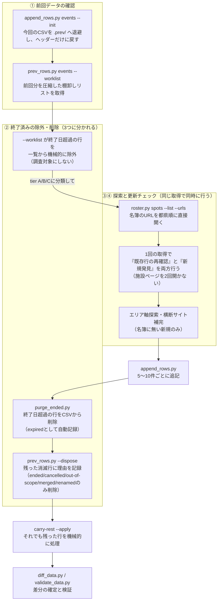
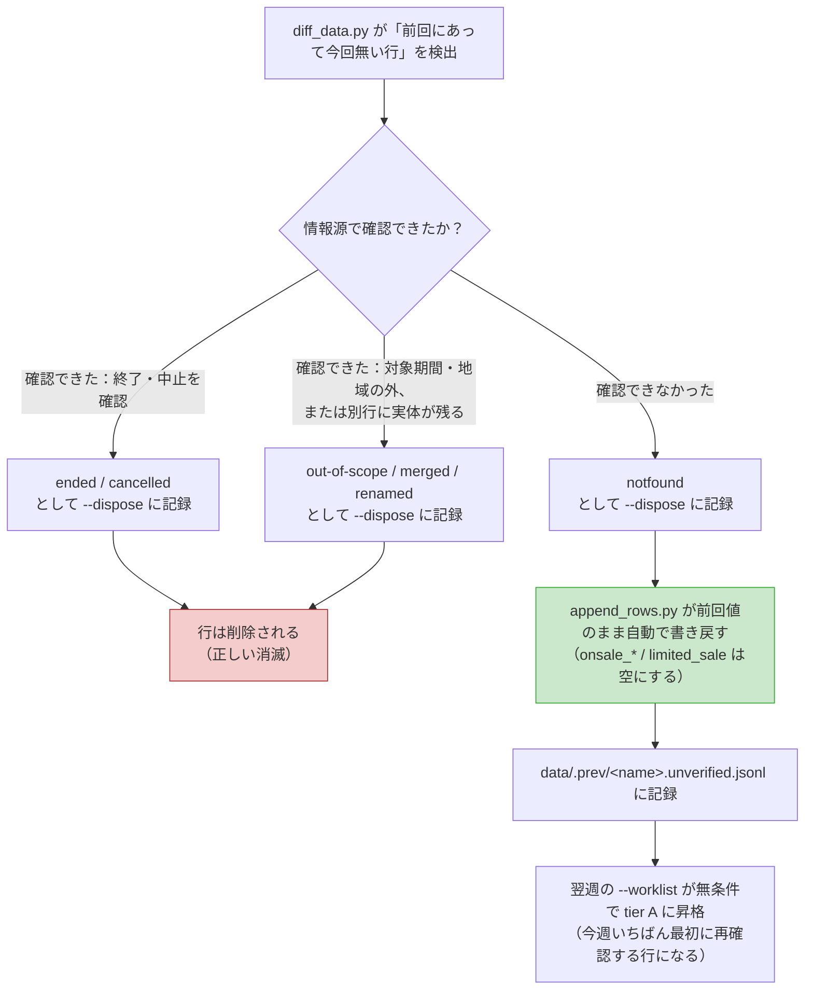

# イベントボード 設計書

## 0. この文書の位置づけ

本書は、イベント・映画情報アグリゲーション・ダッシュボード「イベントボード」の設計を、**なぜそう決めたのか（目的・背景）とセットで**記述したものである。

設計判断の理由を残す狙いは2つある。第一に、将来の変更時に「この仕様は何を守るために存在するのか」が分からず、意図せず前提を壊すことを防ぐため。第二に、本プロジェクトはCSVを週次で自動更新していく運用を前提としており、**データを集める人（またはAI）が、UIの各項目が何のために存在するかを理解していないと、形式的には正しいが役に立たないデータが入ってしまう**ためである。

**「決めたこと」と「やっていること」の乖離は、設計の誤りより見つけにくく、説明したときの信用の毀損が大きい。** そのため本書は、方針を散文で書いて終わりにせず、可能なものは検証スクリプトに落としてある（`tools/validate_data.py` の各 ERROR、`tools/check_robots.py`）。「突き合わせは機械の仕事」という第9.3節の考え方を、本書自身にも当てはめている。

**同じ理由で、週次で動く数字（件数・充足率）を本書の判断根拠にしないこと。** **書き写した値は、書き写した時点から腐りはじめる。** 現在値は `python3 tools/validate_data.py` が毎回先頭に出す。

---

## 1. プロダクト概要

### 1.1 解決する課題

日本のイベント情報は、サイトごとに縦割りになっている。事前調査（第2章）で明らかになった通り、各サイトはそれぞれ異なるタグ設計思想を持ち、扱うイベントの種類も重複が少ない。結果として利用者は、

- 展示を探すならウォーカープラス
- 子連れならいこーよ
- 勉強会ならconnpass
- チケットが必要ならイープラス
- 映画の上映館を調べるなら映画.comやFilmarks

と、**目的ごとに別のサイトを開き直す**必要がある。「今週末、この辺で、何かないか」という素朴な問いに、横断的に答えるサービスが存在しない。

### 1.2 プロダクトの定義

複数の情報サイトから収集したイベント・映画を、**単一の統一スキーマに正規化して1画面に並べ、横断的に検索・絞り込みできるようにするダッシュボード**。予約導線は各サイトへ送客する（自前で決済は持たない）。

さらに、本プロダクトは**価格・クーポン比較レイヤー**を持つ（第7章）。同じイベントでも購入経路によって価格が異なり、各社は不定期にクーポン・セールを配信している。「どこで買うのが一番安いか」を利用者の代わりに調べておくことが、単なるイベント一覧との差別化点である。

### 1.3 3つのタブ

| タブ               | 内容                                                                | データ                                  |
| ------------------ | ------------------------------------------------------------------- | --------------------------------------- |
| **イベント**       | 展示・体験・グルメ・祭り・スポーツ等                                | `data/events.csv`                       |
| **映画**           | 新作公開・名画座リバイバル・野外上映/ドライブイン・特別上映・映画祭 | `data/movies.csv` + `data/theaters.csv` |
| **ライブ・フェス** | ライブ・コンサート・音楽フェス                                      | `data/lives.csv` + `data/venues.csv`    |

**映画を独立したタブに分けた理由**は、イベントとは「探し方」が違うからである。イベントは「いつ・どこで」が固定された一回性の予定だが、映画は同じ作品が多数の劇場で長期間かかる。会場を1つに決められないため、`venue` に単一の会場名を入れる前提のイベントスキーマにそのまま乗せると、「TOHOシネマズ新宿」のような1館だけが代表として表示され、他館で観られることが伝わらない。第5.7節の「チェーン名リンク」はこの問題への回答である。

**ライブ・フェスを独立させた理由**は、映画と同じく「探し方」が違うからである。イベントも映画も「いつ・どこで」だけを見ればよいが、**ライブには行動を促す日付が2つある**——公演日と、チケットの申込締切である。公演は11月でも先行受付の締切は今週、ということが常態で、公演日だけを並べた一覧は「まだ間に合う」と誤解させる。第12章で詳述する。

### 1.4 スコープ外（意図的に持たない機能）

| 持たないもの               | 理由                                                                    |
| -------------------------- | ----------------------------------------------------------------------- |
| 会員登録・ログイン         | 「見て、探して、飛ぶ」だけで価値が完結する。認証は摩擦にしかならない    |
| 自前の決済・在庫管理       | 各サイトが持つ在庫の写しを持つと、必ず実態とズレて誤情報になる          |
| 写真・ポスター等の画像     | 第7.1節で詳述。権利者の許諾の範囲外だから                               |
| リアルタイムスクレイピング | 第3章で詳述。技術的・法的な理由                                         |
| リアルタイム価格追従       | 価格は週次スナップショット。確認日を必ず併記して古さを明示する（第7章） |
| ビルド工程・パッケージ依存 | 静的ホスティングに置くだけで動く状態を維持する（第10章）                |

---

## 2. 事前調査：既存サイトのUI/UX分析

本設計の出発点として、国内外46サイトを列挙し、うち10サイトを個別に調査した。**設計の目的は「どのタグ軸を採用すべきか」を、思いつきではなく実在サービスの選択から逆算すること**にあった。

### 2.1 調査対象（カテゴリ別・46サイト）

1. **総合お出かけポータル（7）** GO TOKYO / ウォーカープラス / じゃらん / レッツエンジョイ東京 / いこーよ / オソトイコ / aumo
2. **レジャー・アクティビティ予約（6）** asoview! / VELTRA / そとあそび / アクティビティジャパン / Klook / 楽天トラベル観光体験
3. **チケット・プレイガイド（13）** チケットぴあ / イープラス / ローソンチケット / 楽天チケット / チケプラ / チケミー / TIGET / LivePocket / teket / Peatix / ZAIKO / ticket board / BUZZチケ
4. **コミュニティ・勉強会（12）** connpass / TECH PLAY / Doorkeeper / こくちーずプロ / ストアカ / Meetup / EventRegist / OpenCU / ATND / everevo / Qube / セミナーズ
5. **訪日外国人向け（5）** Tokyo Cheapo / Time Out Tokyo / Metropolis / GaijinPot / Japan Travel by NAVITIME
6. **ジャンル特化（3）** maifu / hanabi.walkerplus.com / ジモティ
7. **価格比較・クーポン配信（追加調査）** asoview!（クーポン一覧・超特割） / Klook / KKday / アクティビティジャパン / VELTRA / じゃらん遊び体験 / 楽天トラベル観光体験 ／ 会員制優待：JAFナビ・ベネフィットステーション・デイリーPLUS・駅探バリューDays・みんなの優待
8. **映画（映画タブ追加時の調査）** 映画.com / Filmarks / シネマトゥデイ / ぴあ映画生活 ／ シネコン各社：TOHOシネマズ・イオンシネマ・ユナイテッド・シネマ・109シネマズ ／ 名画座：新文芸坐・早稲田松竹・シネマヴェーラ渋谷 ／ The Movie Database (TMDb)

> **7・8が別カテゴリなのは、調査の目的が違うためである。** 7は「同じイベントが複数経路で異なる価格で売られている」ことが本プロダクトの価値の中心になると判断したことによる、価格・クーポンを扱うサイト群の調査。8は上映情報が「作品」と「劇場」の2軸で管理されていることを確認するための、映画タブ向けの調査である。

### 2.2 判明した6つのタグ設計思想

| 類型                   | 代表サイト                                 | 特徴                                    |
| ---------------------- | ------------------------------------------ | --------------------------------------- |
| 階層ジャンル型         | ウォーカープラス、レッツエンジョイ東京、e+ | 大分類→小分類の固定ツリー               |
| 超粒度アクティビティ型 | asoview!（620種以上）                      | 「陶芸」「SUP」など活動名そのものがタグ |
| シーン・同伴者型       | レッツエンジョイ東京、ウォーカープラス     | デート／ひとり／子どもと                |
| 年齢型                 | いこーよ（0〜9歳を1歳刻み）                | 子連れ特化ゆえの独自軸                  |
| 技術キーワード型       | connpass                                   | Python、AWS等が直接タグ                 |
| 主催者・出演者起点型   | e+、connpass                               | 「誰が」から探す                        |

### 2.3 この調査から得た設計上の結論

**全10サイトが共通して持っていたファセットは「エリア」と「日付」の2つだけだった。** それ以外は各サイトのターゲット層に強く依存する。

したがって本プロダクトでは、

- **エリアと日付を第一級の絞り込み軸として、常時表示のボタンに昇格させる**（第4章）
- それ以外（カテゴリ・開催状況・ジャンル・上映形態）は**副次的な軸として折りたたむ**

という優先順位を採用した。**「全サイトが共通で持っている＝ユーザーが最も頻繁に使う軸である」という仮説**に基づく判断である。

映画タブを追加したあとも、この優先順位は変えていない。映画固有の軸（ジャンル・上映形態）は、イベントのカテゴリと同じ「カテゴリ」ボタンの中に収めている（第5.4節）。

---

## 3. データアーキテクチャ

### 3.1 なぜCSV外部ファイルなのか

イベントデータをJavaScript内に持たず、CSV外部ファイルに分離しているのは次の3つの理由による。

| 目的                             | 説明                                                            |
| -------------------------------- | --------------------------------------------------------------- |
| **非エンジニアが更新できる**     | ExcelやGoogleスプレッドシートで直接編集できる。HTMLを触らせない |
| **AIによる週次自動更新に適する** | 収集タスク（第9章）の出力先が単一ファイルで済む                 |
| **表示ロジックとデータの分離**   | UIを改修してもデータに触れずに済み、逆も同様                    |

この分離は第10章のフォルダ構成にも反映してある。週次で差し替わるのは `data/` だけで、`index.html` と `assets/` はほとんど変わらない。

### 3.2 単一情報源に一本化した（過去の設計からの変更）

初期実装では、`file://` で直接HTMLを開いても動くように、HTML内に同内容のCSV文字列を埋め込み、外部CSVの `fetch` が失敗した場合のフォールバックとして使う二重構成を取っていた。

その後、**ローカルで直接開く運用は想定しないと決定した**ため、この構成は廃止した。理由は以下の通り。

- **データの入り口を1つに保つ**ため。フォールバックがあると、「今表示されているのはCSVの最新版か、それとも埋め込みデータか」が利用者からもタスク実行者からも分からなくなる
- **週次更新の運用を単純にする**ため。二重構成では、CSV更新のたびにHTML内の文字列も手作業で同期する必要があり、更新漏れによる「サイトによって古いデータが残る」という不整合を生みやすかった

現在は `data/` 配下のCSVを `fetch` で読み込む一本のみで、失敗時はフォールバックせず、**エラーであることをそのまま利用者に伝える**（読み込み中の表示をエラーメッセージに差し替える）。

**この方針は「別のパスも試す」フォールバックも禁じている。** CSVの置き場所を変えたときに、旧パスも読めるようにしておくと一時的には壊れないが、それはまさに「今どのファイルを見ているのか分からない」状態を作る。だからエラーメッセージのほうに期待するパス（`data/events.csv`）を明記して、置き場所の取り違えを即座に診断できるようにしてある。

> **運用上の前提**: Webサーバー経由で配信すること。`file://` で直接開くとブラウザのCORS制約によりCSVを読み込めず、エラー表示になる。

### 3.3 3つのCSVとその役割分担

| ファイル            | 行数 | 更新頻度                 | 役割                           |
| ------------------- | ---: | ------------------------ | ------------------------------ |
| `data/events.csv`   |  125 | 週次（自動）             | イベント本体                   |
| `data/movies.csv`   |  107 | 週次（自動）             | 作品＋上映情報                 |
| `data/lives.csv`    |  106 | 週次（自動）             | ライブ・フェスの公演           |
| `data/theaters.csv` |   85 | 週次（`roster.py` 経由） | シネコンチェーンの店舗マスター |
| `data/venues.csv`   |  150 | 週次（`roster.py` 経由） | ライブ会場のマスター           |

> **行数は目安であって、判断の根拠に使わないこと**——週次で動く値をここに書き置く以上、必ず古くなる。現在値は `python3 tools/validate_data.py` が毎回先頭に出す。
>
> マスター2つを手動更新にしないのは、名簿は放っておけば必ず腐るためである。`roster.py` 経由で週次の収集タスクが開館・閉館・改称を反映する。**人が触るのは名簿の内容ではなく、名簿を育てる規則のほうである。**

**`theaters.csv` / `venues.csv` を分離した理由**は更新頻度が違うからである。上映作品も公演も毎週入れ替わるが、劇場や会場の所在地は年単位でしか変わらない。同じファイルに混ぜると、週次タスクが毎回マスターデータを書き直すことになり、変えるべきでないデータを壊すリスクが生まれる。

ライブでは理由がもう1つある。**ツアーは同じ会場が何行にも出てくる。** 「日本武道館」が6行に現れるたびに緯度経度を書かせると、表記ゆれと座標のずれの温床になる。`venues.csv` に1回書いて引くほうが正しい。

どちらも**任意データ**として扱う。読み込みに失敗しても一覧の表示は続行し、チェーン名・会場名は（地図が引けないだけで）プレーンテキストとして表示される。マスターデータの欠落が主機能を止めない構造にしてある。

### 3.4 CSVスキーマ

#### 3.4.1 `data/events.csv`（45列固定）

| 列名                                                                                     | 型           | 必須 | 説明と設計意図                                                                                                                                                                                                                               |
| ---------------------------------------------------------------------------------------- | ------------ | :--: | -------------------------------------------------------------------------------------------------------------------------------------------------------------------------------------------------------------------------------------------- |
| `id`                                                                                     | 整数         |  ✓   | 一意識別子                                                                                                                                                                                                                                   |
| `title`                                                                                  | 文字列       |  ✓   | イベント名                                                                                                                                                                                                                                   |
| `kana`                                                                                   | 文字列       |      | タイトルの読み（ひらがな/カタカナ）。かな検索用（第5.8節）。読みが自明でない固有名詞だけでよい                                                                                                                                               |
| `cats`                                                                                   | 文字列       |  ✓   | カテゴリキー。複数は `art\|ent` のように `\|` 区切り。**CSVのカンマと衝突しない区切り文字を選んだ**                                                                                                                                          |
| `area`                                                                                   | 文字列       |  ✓   | 人間向けの地名表記（例：東京都・江東区）                                                                                                                                                                                                     |
| `venue`                                                                                  | 文字列       |  ✓   | 会場名。不明時は `-`                                                                                                                                                                                                                         |
| `venue_url`                                                                              | URL          |      | 会場・施設そのものの公式サイト。イベントページ（`official_url`）とは別                                                                                                                                                                       |
| `pref`                                                                                   | 列挙         |      | `tokyo`/`kanagawa`/`saitama`/`chiba`/`ibaraki`/`tochigi`/`gunma`/`other`。**エリア絞り込みの機械可読キー。`area`と分離したのは、表記ゆれで絞り込みが壊れるのを防ぐため**                                                                     |
| `start_date`                                                                             | `YYYY-MM-DD` |      | 開催開始日                                                                                                                                                                                                                                   |
| `end_date`                                                                               | `YYYY-MM-DD` |      | 開催終了日。**単日開催では `start_date` と同じ日を入れる。空欄は「終了日が未定」の意味**（第3.9節）                                                                                                                                          |
| `dates`                                                                                  | 日付の並び   |      | 飛び日程の実開催日を `\|` 区切りで。連続した会期では空欄（第3.9節）                                                                                                                                                                          |
| `open_time` / `start_time` / `end_time`                                                  | `H:MM`       |      | 開場・開始・終了時刻。分からない時刻は書かない                                                                                                                                                                                               |
| `date_note`                                                                              | 文字列       |      | 構造化できない但し書き（`オールナイト` `土日祝のみ` など）。日付そのものは書かない                                                                                                                                                           |
| `backup_date`                                                                            | 日付の並び   |      | 予備日（雨天・荒天で順延したときの日）。**会期には含めない**。カードの「くわしく」に出す（第3.9.5節）                                                                                                                                        |
| `date`                                                                                   | 文字列       |      | **ISOの日付に落とせない日程のための自由記述**（`10月中旬〜下旬（見頃予想）` など）。通常は空欄で、入っている行はこの文字列がそのまま表示される。**月・季節までは読み取れる場合は `start_date`/`end_date` も併せて設定すること**（第3.9.6節） |
| `status`                                                                                 | 列挙         |      | 日付を1つも持たない行の予備。通常は空欄で、`本日開催`/`まもなく開催`/`開催中`/`発売中`/`通年予約可`/`終了` は**表示のたびに日付から決まる**（第3.9節）                                                                                       |
| `rank`                                                                                   | 整数         |      | 同上。並べ替えの優先度は `status` の並び順から決まる                                                                                                                                                                                         |
| `series_id`                                                                              | 文字列       |      | 巡回展・複数会場開催をまとめるキー。「この巡回展の他の会場」を引く（ライブの `tour_id` と同じ役割。第12.7節）                                                                                                                                |
| `announced_date`                                                                         | `YYYY-MM-DD` |      | 公表・掲載日。7日以内なら「NEW」バッジが出る                                                                                                                                                                                                 |
| `is_additional`                                                                          | 真偽値       |      | `1` なら追加開催・会期延長。カードに「追加開催」バッジが出る                                                                                                                                                                                 |
| `onsale_label` / `onsale_start` / `onsale_start_time` / `onsale_end` / `onsale_end_time` |              |      | 事前予約・抽選・整理券の受付期間。**時刻列を持つのは、先着順の販売では時刻が情報の本体だから**（第12.2節と同じ理由）                                                                                                                         |
| `limited_sale`                                                                           | 文字列       |      | その回にだけ出ている枠（見切れ席・追加枠・当日券）                                                                                                                                                                                           |
| `price`                                                                                  | 文字列       |  ✓   | 料金の人間向け表記                                                                                                                                                                                                                           |
| `price_official`                                                                         | 整数         |      | 公式の正規料金（大人1名・円）。比較の基準値                                                                                                                                                                                                  |
| `price_best`                                                                             | 整数         |      | 最安経路の総額（手数料込み・大人1名・円）                                                                                                                                                                                                    |
| `discount_pct`                                                                           | 整数         |      | 割引率（%）。**上2つが揃った場合のみ記入**（第7章）                                                                                                                                                                                          |
| `best_source`                                                                            | 文字列       |      | 最安を提供しているサイト名（例：`Klook`）                                                                                                                                                                                                    |
| `coupon_note`                                                                            | 文字列       |      | 配布中クーポン・条件付き優待の説明                                                                                                                                                                                                           |
| `price_checked`                                                                          | `YYYY-MM-DD` |      | 価格を確認した日。**価格を記入したら必須**。ヘッダーの「最終更新日」とフッターの「◯年◯月◯日時点」はこの列の最大値から自動生成する                                                                                                            |
| `price_condition`                                                                        | 文字列       |      | 割引の適用条件。**条件付きの割引を書いたら必須**（第7.2.2節）                                                                                                                                                                                |
| `source`                                                                                 | 文字列       |  ✓   | 出典サイト名                                                                                                                                                                                                                                 |
| `url`                                                                                    | URL          |  ✓   | **予約ページ**。最安で予約できる導線を入れる（第9章）                                                                                                                                                                                        |
| `official_url`                                                                           | URL          |      | **公式サイト**。予約サイトとは別。`url` と同じ値なら画面には出さない（第5.5節）                                                                                                                                                              |
| `lat` / `lng`                                                                            | 小数         |      | 会場のおおよその代表座標。距離計算・地図の範囲検索用                                                                                                                                                                                         |
| `desc`                                                                                   | 文字列       |  ✓   | 「くわしく」に表示する解説                                                                                                                                                                                                                   |
| `note`                                                                                   | 文字列       |      | 利用者への注意書き（雨天中止・入場制限など）                                                                                                                                                                                                 |
| `parking`                                                                                | 文字列       |      | 会場の駐車場情報（例：`あり（有料・120台）`）。「くわしく」に表示する。不明なら空欄                                                                                                                                                          |
| `nearest_station`                                                                        | 文字列       |      | 最寄り駅と徒歩時間（例：`上野駅（徒歩10分）`）。「くわしく」に表示する。不明なら空欄                                                                                                                                                         |

#### 3.4.2 `data/movies.csv`（44列固定）

イベントと意味が重なる列は**同じプロパティ名にそろえてある**（`theater`→`venue`、`release_date`→`startDate` 等）。これにより、日程カレンダー・地図の範囲検索・現在地からの距離といったイベント用に書いたロジックが、そのまま映画にも使い回せる。

| 列名                                                                                                                 | 説明                                                                                                                   |
| -------------------------------------------------------------------------------------------------------------------- | ---------------------------------------------------------------------------------------------------------------------- |
| `id` / `title` / `area` / `pref` / `price` / `source` / `url` / `official_url` / `lat` / `lng` / `desc` / 日程の各列 | イベントと同義                                                                                                         |
| `genre`                                                                                                              | `anime`/`jp-live`/`foreign`/`doc`/`fam`/`tokusatsu`/`music`。`\|` 区切りで複数可                                       |
| `screening_type`                                                                                                     | `new`(新作公開)/`revival`(名画座・リバイバル)/`outdoor`(野外上映・ドライブイン)/`special`(特別上映)/`festival`(映画祭) |
| `theater`                                                                                                            | 上映会社・会場。書き方は第5.7節。`\|` 区切りで複数可                                                                   |
| `release_date`                                                                                                       | 公開日（イベントの `start_date` に対応）                                                                               |
| `end_date`                                                                                                           | 上映終了日                                                                                                             |
| `theater_url`                                                                                                        | 会場が1つの行のとき、会場名をこのURLへのリンクにする                                                                   |
| `note`                                                                                                               | 「爆音上映」「オールナイト」等の注意書き                                                                               |

開催状況は `本日が最終上映`/`まもなく公開`/`上映中`/`前売り券発売中`/`上映終了` で、**CSVではなく表示のたびに日付から決まる**（第3.9節）。**画像URLの列は持たない**（第7.1節）。

#### 3.4.3 `data/lives.csv`（42列固定）

イベント・映画と意味が重なる列は、ここでも**同じプロパティ名にそろえてある**（`venue` `area` `pref` `startDate` `endDate` `date` `status` `rank` `lat` `lng` ほか）。日程カレンダー・地図の範囲検索・現在地からの距離が、一行も書き足さずにそのまま効く。

| 列                                                                                                                                      | 説明                                                                                                         |
| --------------------------------------------------------------------------------------------------------------------------------------- | ------------------------------------------------------------------------------------------------------------ |
| `id` / `title` / `area` / `venue` / `pref` / `price` / `source` / `url` / `official_url` / `lat` / `lng` / `desc` / `note` / 日程の各列 | イベントと同義                                                                                               |
| `kana`                                                                                                                                  | タイトル・アーティスト名の読み（ひらがな/カタカナ）。かな検索用。読みが自明でない固有名詞だけでよい          |
| `tour_id`                                                                                                                               | 同じツアー・同じフェスの行に共通の値。「このツアーの他の公演」を引くキー（第12.7節）                         |
| `artists`                                                                                                                               | 出演者。`\|` 区切り。**検索対象であり、複数出演のときはカード本文の出演者行の材料でもある**（第12.5節）      |
| `genre`                                                                                                                                 | `rock`/`pop`/`idol`/`kpop`/`hiphop`/`dance`/`jazz`/`classical`/`anime`/`other`。`\|` 区切りで複数可          |
| `live_type`                                                                                                                             | `fes`/`oneman`/`event`/`classic`/`free` のいずれか1つ                                                        |
| `start_date` / `end_date`                                                                                                               | 公演日。複数日開催のフェスと連日公演は `end_date` に最終日、**単日公演は `start_date` と同じ日**（第3.9節）  |
| `announced_date`                                                                                                                        | 公演・追加公演が発表された日。7日以内なら「NEW」バッジが出る                                                 |
| `is_additional`                                                                                                                         | `1` なら追加公演。カードに「追加公演」バッジが出る                                                           |
| `onsale_label` / `onsale_start` / `onsale_start_time` / `onsale_end` / `onsale_end_time`                                                | 直近の受付の名称と期間。**時刻列を持つのは、先着順の販売では時刻が情報の本体だから**（第12.2節）             |
| `limited_sale`                                                                                                                          | その公演にだけ出ている枠（見切れ席・追加席・公式リセール・当日券）。**ツアーでは公演ごとに違う**（第12.7節） |
| `venue_url`                                                                                                                             | `venues.csv` に無い臨時会場のときだけ使う。会場名をこのURLへのリンクにする                                   |
| `parking`                                                                                                                               | 会場の駐車場情報（例：`あり（有料・300台）`）。「くわしく」に表示する。不明なら空欄                          |
| `nearest_station`                                                                                                                       | 最寄り駅と徒歩時間（例：`国際展示場駅（徒歩7分）`）。「くわしく」に表示する。不明なら空欄                    |
| `apple_music_url`                                                                                                                       | メインアーティスト1組の Apple Music アーティストページ。「くわしく」に表示する（第12.11節）                  |
| `lineup_id`                                                                                                                             | フェスだけ。`data/lineups.csv` の日割りラインナップを引くキー（第12.12節）。空欄ならボタンが出ないだけ       |

開催状況は `本日開催`/`まもなく開催`/`開催中`/`公演予定`/`終了` で、**CSVではなく表示のたびに日付から決まる**（第3.9節）。**価格比較の列（`price_official` 等）は持たない**（第12.8節）。**画像URLの列も持たない**（第7.1節）。

`lat`/`lng` は、`venues.csv` に載っている会場なら空欄でよい（読み込み後に会場マスターから補われる）。`lives.csv` 側に値がある行は上書きしない——臨時会場ではそちらが正しいためである。

#### 3.4.3.1 `data/lineups.csv`（7列固定）

`lineup_id,date,stage,artist,is_headliner,apple_music_url,note`。`lives.csv` の `lineup_id` と同じ値の行が、そのフェスの日割りラインナップになる（第12.12節）。**1行＝そのフェスの、その日の、そのアーティスト1組**。`date` と `stage` は空欄可（日割り・ステージ割りの発表前）。本体データと同時に読み込まれ、全出演者名が検索の索引に入る。

#### 3.4.4 `data/theaters.csv`（12列固定）／`data/venues.csv`（14列固定）

`theaters.csv` は `chain,name,pref,area,lat,lng,url` の7列に、名簿の保守用の5列（`status,first_seen,last_hit,hit_count,note`）が続く**12列**。`chain` が `movies.csv` の `theater` 列と突き合わせるキーになる。

`venues.csv` は `venue,kind,pref,area,capacity,lat,lng,url` の8列に、保守用の6列（`status,closed_until,first_seen,last_hit,hit_count,note`）が続く**14列**。`venue` が `lives.csv` の `venue` 列と突き合わせるキーで、**完全一致が必要**（一致しないと会場ピッカーと会場モーダルが機能しない）。`kind` は `dome`/`arena`/`hall`/`livehouse`/`outdoor`。`capacity` を持たせているのは、会場規模がライブ体験とチケットの取りやすさの目安になるためである（第12.6節）。

**保守用の列を末尾に足せるのは、表示側が列名で引いているからである**（位置では引かない）。この2つのファイルは「ダッシュボードが読むマスター」と「収集タスクが育てる名簿」の二役を持っており、後者のための列が前者を壊さないのはこの性質による（第10章）。

### 3.5 CSVの欠損・想定外の値に耐えるという契約（重要）

**このページはCSVを読み込んで表示するものであり、CSVの中身は週次で機械的に差し替わる。** したがって「CSVが常に完璧である」ことを前提にした表示ロジックは、いずれ必ず壊れる。

そこで**表示側は、どの列が空でも・未知の値が来ても壊れないことを契約として持つ**。データを直して回避するのではなく、受け止める側で吸収する。

| 起こりうること                      | 表示側の振る舞い                                                                                           |
| ----------------------------------- | ---------------------------------------------------------------------------------------------------------- |
| `source` が空                       | ボタンを「◯◯で予約する」ではなく「予約ページを開く」にする（「で予約する」という動詞だけの文言を作らない） |
| `price` が空                        | 価格行そのものを出さない（空要素が余白だけ残さない）                                                       |
| `official_url` が `url` と同じ      | 公式リンクを出さない（同じ遷移先のリンクを2つ並べない）                                                    |
| `desc`・価格・クーポンが全て空      | 「くわしく」ボタンごと出さない（中身のない箱を開かせない）                                                 |
| `status` / `cats` が未知の値        | 既定の見た目にフォールバックする。未知の `status` は絞り込みチップにも出す                                 |
| `rank` / `id` が欠損・不正          | 並び順の既定値に寄せる。DOMのidは行番号で採番し、CSVのid重複の影響を受けない                               |
| `lat` / `lng` が数値でない          | `null` として扱い、距離計算・地図の対象外にする（第5.3節の注記を表示）                                     |
| `title` 等に `"` `<` `&` が含まれる | すべてHTMLエスケープして描画する                                                                           |

最後の項目は実害が出ていた。タイトルに `"` を含む行（`STORES Tech Conf 2026 "World 2"`）で `aria-label` が途中で切れ、壊れた属性が生成されていた。**CSV由来の値をHTMLに差し込む箇所は、例外なくエスケープ関数を通す。**

> **設計上の含意**: この契約があるおかげで、収集タスクは「分からない列は空のままにしてよい」と安心して判断できる。第3.6節（憶測で埋めない）と第7.2.3節（検証済みの値のみ表示）は、表示側がこの契約を守っているからこそ成立する。

### 3.6 日付の「空欄」を許容する設計

`start_date` / `end_date` は**空欄を許容する**。これは手抜きではなく、明示的な設計判断である。

**目的：情報がないことを、憶測で埋めない。**

例えば「〜2026.10.12」としか公表されていないイベントは、開始日が不明である。ここに「たぶん4月頃だろう」と推測値を入れると、それは**データ上は本物と区別がつかない捏造**になる。空欄なら「不明」という事実がそのまま残る。

そのうえで、絞り込みロジック側が空欄を安全に解釈する：

```js
// 期間が重なっていれば表示する。空欄の端は「制約なし」とみなす。
if (ev.endDate && ev.endDate < 指定開始日) return false; // 終了済み
if (ev.startDate && ev.startDate > 指定終了日) return false; // まだ先
return true;
```

**空欄側では絶対に除外しない**のがポイント。「不明だから」という理由でイベントを取りこぼすより、多めに表示して利用者に判断してもらうほうが、この種のサービスでは損失が小さい。

### 3.7 「本日」をハードコードしない

**「本日」を `const TODAY = "..."` のような定数で埋め込まない。** CSVを差し替えるたびにHTML側も手で書き換える必要が生じ、忘れれば日付がずれるためである。出どころは用途ごとに分ける。

| 用途                                                                 | 出どころ                                         |
| -------------------------------------------------------------------- | ------------------------------------------------ |
| カレンダーの初期表示・期間プリセット・並べ替えの起点・開催状況の判定 | **日本時間の現在日**（第3.9.3節）                |
| ヘッダー「最終更新日」                                               | **そのタブのCSVが最後に更新された日**（第3.8節） |
| フッター「◯年◯月◯日時点」（イベントタブ）                            | `price_checked` の最大値＝価格を調査した日       |

**「本日」と「データの鮮度」を別の出どころにしたのが要点。** 前者は今この瞬間であり、後者は調査した日である。同じ値で兼ねると、どちらかが必ず嘘になる。

ヘッダーとフッターの日付が食い違うことがあるが、これは正しい。**ヘッダーは「ファイルを差し替えた日」、フッターは「価格を調べた日」**で、意味が違うためである。

### 3.8 「最終更新日」はタブごとに、ファイル自体の更新日から出す

ヘッダーの「最終更新日」は、**表示中のタブが読んでいるCSVの更新日**を出す。イベント・映画・ライブは別々のスキルが別々のタイミングで更新するので、1つの日付で代表させると必ずどれかが嘘になる。タブを切り替えると表示も切り替わる。

**`price_checked` の最大値では代用できない。** 全タブ共通で出せば映画・ライブを見ている人にイベントの調査日が出るうえ、`price_checked` は「価格を調べた日」であって「データを差し替えた日」ではない（そもそも `movies.csv` / `lives.csv` はこの列を持たない）。

出どころは次の優先順で1つに決める。**どちらも「そのファイルがいつ更新されたか」を指しており、測り方が違うだけである。**

| 優先 | 出どころ                                                              | 使われる場面          |
| ---: | --------------------------------------------------------------------- | --------------------- |
|    1 | `data/updated.json` — そのCSVの**中身**が最後に変わったコミットの日時 | 本番（GitHub Pages）  |
|    2 | CSVレスポンスの `Last-Modified`                                       | ローカルのWebサーバー |
|    — | どちらも取れなければ `–`                                              | —                     |

**`Last-Modified` だけに頼れない理由**が、この設計の出発点である。`actions/checkout` は全ファイルの mtime をチェックアウト時刻にそろえるため、そのまま配信すると3つのCSVの `Last-Modified` が「デプロイした日時」で揃ってしまい、**タブごとの差がそもそも生まれない**。そこでデプロイ時に git の履歴から各CSVの更新日時を取り、`data/updated.json` に書き出している（`.github/workflows/pages.yml`）。ファイル単位の履歴を引くために `fetch-depth: 0` が要る。

#### 単純な `git log -1 -- <path>` では足りない（実際に踏んだ）

`git log -1 --format=%cs -- data/events.csv` では**間違った日付を返す**。フォルダ再編でファイルを移動しただけのコミットが「データの更新」として数えられ、更新日が収集日から再編日に化ける。しかも `git log` は既定で rename を追跡しないため、**移動より前の本当の更新履歴が見えなくなる**。

次の2点で解いている。

| 対処                                   | 効果                                               |
| -------------------------------------- | -------------------------------------------------- |
| `--follow -M`                          | 名前の変更をまたいで履歴を辿る                     |
| `R100` / `C100` のコミットを読み飛ばす | 中身が変わっていない移動・複製を「更新」と数えない |

**「ファイルが触られた日」ではなく「中身が変わった日」を出す**、というのがこの列の定義である。データを差し替えていない週にリファクタでファイルが動いても、更新日は動かない。

#### 表示は日本時間に固定する

`updated.json` には日付ではなく日時（`%cI`）を書き、表示側で**日本時間の日付**に直す。`Last-Modified` 経路も同じ換算を通す。

閲覧者のタイムゾーンで換算すると、同じデータを見ている人どうしで表示が1日ずれる（7/26 22:29 UTC のコミットは JST では 7/27）。関東のイベントを日本の利用者に見せるダッシュボードなので、**誰が見ても同じ「日本での更新日」**になるほうが説明がつく。

すでに日付だけ（`YYYY-MM-DD`）の値が入っている場合は換算にかけずそのまま使う。この形式は仕様上UTCの0時と解釈され、西回りのタイムゾーンで前日にずれるためである。

逆にローカルのWebサーバーでは mtime が実際の更新時刻なので、`updated.json` が無くても `Last-Modified` が正しい答えになる。そのため `updated.json` は**コミットしない**（コミットすると、ローカルでCSVを編集している最中でも古い日付が優先されてしまう）。

**CSVの中身の日付には落とさない。** `price_checked` へフォールバックすると、画面に出ている日付が「差し替えた日」なのか「調査した日」なのか利用者にもタスク実行者にも分からなくなる。第3.2節と同じ理由である。

---

### 3.9 日程は「書き置かない」——表示文字列も開催状況も、見るたびに組み立てる

CSVには**機械が読める事実だけ**を置く。画面に出る日付の文字列（`2026.9.5(土) 開場16:00／開演18:00`）も、開催状況のバッジ（`開催中` `まもなく開催`）も、`assets/js/schedule.js` が表示のたびに組み立てる。

#### 3.9.1 なぜやめたのか

表示用の文字列や開催状況を収集タスク（＝生成AI）に書き込ませると、別々の壊れ方が2つ起きる。

**1つ目：表記がそろわない。** 実測では `date` 列が3ファイル339行で **90通り以上の書式**に散った。同じ「8月1日から9月30日まで」が `2026.8.1〜9.30` にも `2026-08-01〜2026-09-30` にも `2026年8月1日〜9月30日` にもなり、曜日の有無、`〜` と `~` と `～` の混在、括弧の全角半角まで行ごとに違う。**毎週ゼロから書き起こす書き手に「書式を守れ」と指示しても、これは必ず再発する。**

**2つ目：収集した日で時間が止まる。** `status` は収集を実行した日の判定なので、週の後半に見た人には、すでに始まっている催しが「まもなく開催」のまま出て、終わった催しが「開催中」のまま残る。**データが古いほど、画面の嘘が増えていく。** 第3.7節（「本日」をハードコードしない）で HTML から追い出した問題が、CSVの中で再現するということである。

原因は同じで、**計算できる値を、計算せずに書き置く**ことにある。

#### 3.9.2 何をCSVに置くか

| 列                                      | 置くもの                                                                                        |
| --------------------------------------- | ----------------------------------------------------------------------------------------------- |
| `start_date` / `end_date`               | 会期。**単日開催は両方に同じ日。空欄の `end_date` は「終了日が未定」という別の意味を持つ**      |
| `dates`                                 | 飛び日程（連続していない複数日）の実開催日を `\|` 区切りで。連続した会期では空欄                |
| `open_time` / `start_time` / `end_time` | 開場・開始・終了時刻（`H:MM`）。**分からない時刻は書かない**——`0:00` と書くのは書かないより悪い |
| `date_note`                             | 構造化できない但し書き（`オールナイト` `9.13は予備日` `土日祝のみ`）。日付そのものは書かない    |
| `backup_date`                           | 予備日（雨天・荒天で順延したときの日）。**会期には含めない**（第3.9.5節）                       |
| `date`                                  | **逃げ道。** ISOの日付に落とすと持っていない精度を騙ることになる日程だけ、自由記述で書く        |

表示の組み立ては1つの文法にそろえてある。

```
会期  [空白]  時刻  （但し書き）

2026.8.8(土)                          単日
2026.8.8(土)〜11(火)                  連続した会期（右側は重なる年・月を落とす）
2026.12.28(月)〜2027.1.5(火)          年をまたぐとき
2026.8.7(金)〜                        終了日が未定
〜2026.8.30(日)                       開始日が不明
2026.8.10(月)・11(火)・14(金)         飛び日程（8日を超えたら「ほか◯日」）
2026.9.5(土) 開場16:00／開演18:00     時刻つき
```

曜日を計算で出すのが要点の1つである。書き置くと「日付を直したのに曜日が前のまま」という、読み手には見破れない嘘が残る。時刻の呼び方（`開演`／`上映`／`開始`）だけはタブごとに違うので `config.js` の `TIME_WORDS` に置き、**文法そのものは3タブで1つ**にしてある。

#### 3.9.3 開催状況をどう決めるか

`start_date` / `end_date` と「本日」を比べて段階（phase）を出し、タブごとの言い回しに割り当てる（`config.js` の `STATUS_BY_PHASE`）。

| phase     | 条件                           | イベント     | 映画           | ライブ         |
| --------- | ------------------------------ | ------------ | -------------- | -------------- |
| `ended`   | 終了日 < 本日                  | 終了         | 上映終了       | 終了           |
| `backup`  | 今日が予備日                   | 本日予備日   | 本日予備日     | 本日予備日     |
| `last`    | 終了日 = 本日                  | 本日開催     | 本日が最終上映 | 本日開催       |
| `opening` | 開始日 = 本日（まだ続く）      | 開催中       | 上映中         | 本日開催       |
| `ongoing` | 会期の途中                     | 開催中       | 上映中         | 開催中         |
| `gap`     | 会期の中だが今日は開催日でない | 本日は休み   | 本日は上映なし | 本日は公演なし |
| `openrun` | 始まっているが終了日未定       | 開催中       | 上映中         | 開催中         |
| `soon`    | 開始まで14日以内               | まもなく開催 | まもなく公開   | まもなく開催   |
| `far`     | それより先                     | 発売中       | 前売り券発売中 | 公演予定       |

並べ替えの優先度（`rank`）は、`EVENT_STATUS_STYLE` などの**バッジ表の並び順そのもの**にした。順位を別のところに書くと、必ず片方だけ古くなるためである。

判定は日付の単位で行う。開演時刻を持っている行でも「開演を過ぎたら終了」とはしない——終演時刻はほとんどの行で未登録で、公演中も物販も続いているのに「終了」と出すほうが、当日の来場者には有害だからである。

**「本日」は日本時間で採る。** データは関東の催しで、日付はすべて日本時間で書かれている。閲覧者の端末のタイムゾーンで今日を決めると、同じデータを見ている人どうしで判定が1日ずれる。開催状況がこの値だけで決まる以上、基準は**データ側の暦**にそろえる。

#### 3.9.4 この設計でも扱えないこと

逃げ道（`date` 列の自由記述）を用意したのは、次のものが構造化できないと分かったうえでの判断である。

| 扱えないもの                | 例                                   | どうしているか                                              |
| --------------------------- | ------------------------------------ | ----------------------------------------------------------- |
| 繰り返しの規則              | 「8月の毎週土日」                    | `dates` に実日付を並べるか、`date` に自由記述               |
| 日ごとに違う時刻            | 「9.5 開演18:00、9.6 開演16:00」     | 代表値を置かず `date_note` に全部書く                       |
| 1日に複数回（第1部・第2部） | 「第1部 開演15:00、第2部 開演19:00」 | 同上。行を分けるほどの別公演ではないため                    |
| 祝日の表記（`(月・祝)`）    | 「2026.9.21(月・祝)」                | 祝日表を持たないので `(月)` になる。**移行で失われた情報**  |
| 日付を持たない行の開催状況  | 「会期は公式サイト参照」             | CSVの `status` 列に戻る。**この行だけは時間が止まったまま** |

最後の1つは、**この変更で解決していない**。日付が無い行の開催状況は計算のしようがない。実データでは3行なので、いまは扱いを揃えることを優先した。

### 3.9.5 予備日と、飛び日程の非開催日

**予備日は会期に含めず、「くわしく」に置く。** 花火大会の予備日には「本開催が成立すれば、使われずに終わる」という性質がある。これを `end_date` に足すと、本開催が無事に終わった翌日も「開催中」と表示され続ける。かといって日付欄に `2026.8.8(土)（予備日8.9）` と並べて書くと、本開催と同じ強さで目に入り、8/9も何かある日のように読める。**カードの一等地は「いつ行くか」に使うべきで、予備日が意味を持つのは荒天のときだけ**——そのとき利用者はどのみち公式サイトを見に行く。

そこで `backup_date` 列を独立させ、会期（`start_date`〜`end_date`）からも開催状況の判定からも外し、「くわしく」の中に `予備日 2026.8.9(日)（荒天などで順延された場合）` として出す。`validate_data.py` は、予備日が会期の中に入っている行を ERROR で止める。

ただし**予備日の当日だけは別扱い**にする。本開催が流れていればその日にやるのに、会期を過ぎたという理由だけで「終了」と出すのは、その日に行ける人に対して早すぎる。この日は `backup` 段階として **`本日予備日`** のバッジを出し、並べ替えでも「終わったもの」の側に落とさず、日程で「今日」を選んだときにも残す。画面は順延されたかどうかを知らないので、**「今日は予備日である」という確かな事実だけを出して、あとは公式サイトに委ねる**。

| 日（本開催8/8・予備日8/9の花火大会） | バッジ         |
| ------------------------------------ | -------------- |
| 8/7                                  | まもなく開催   |
| 8/8                                  | 本日開催       |
| 8/9                                  | **本日予備日** |
| 8/10                                 | 終了           |

実際に順延されたら、収集側が `start_date`/`end_date` を新しい日に書き換えて `backup_date` を空にする。**先回りして会期を延ばすことはしない。**

**飛び日程の非開催日は、`dates` を持つ行だけ実開催日で判定する。** 「8.10・11・14・16 開催」の8.12に「開催中」と出すのは、その日に行ける人を空振りさせる嘘である。`dates` がある行では、会期の端ではなく実開催日の並びを見て、今日がそこに含まれなければ `gap`（本日は休み／本日は上映なし／本日は公演なし）とし、「くわしく」に次の開催日を添える。

同じ判定を**日程の絞り込みにも通した**。バッジが「本日は休み」と言っているのに、日程で「今日」を選ぶと出てくる、というのでは直したことにならない。`dates` を持つ行は、指定期間に実開催日が1つでも入っているかで絞る。

この2つは、どちらも**「会期の端だけを見る」という単純化が、実データでは嘘になる**という同じ形の問題だった。

### 3.9.6 幅のある予測日程は、`date` に書くだけでは絞り込みが壊れる

ISOの日付に落とせない日程を `date` 列の自由記述に逃がす（第3.9.4節）だけでは足りない。**`date` は表示専用で、`start_date`/`end_date` が空のままだと、日程の絞り込みからは「無期限」として扱われる**（第3.6節）。10月開催の催しが8月の日付で絞っても一覧に出てくることになる。

原因は `matchesDate()`（`filters.js`）の「不明な端は制約なしとみなす」という規則にある。これは「開始日が本当に分からない」行を取りこぼさないための意図的な設計だが、**「月ならおおよそ分かる」行に同じ扱いを当てると嘘になる**。両者は違う——前者は情報が無く、後者は精度を落とせば書ける情報がある。だから扱いを分ける。

- **月・季節までは読み取れる行**（「10月中旬〜下旬」「2026年夏」）は、`start_date`/`end_date` に**その月・季節をまるごと**設定する（10月なら `2026-10-01`〜`2026-10-31`、夏なら `2026-06-01`〜`2026-08-31`）。表示は引き続き `date` の自由記述（「2026年10月中旬〜下旬（見頃予想。開花状況により変動）」）のままで、**内部の会期だけを広げに寄せて確保する**。中旬〜下旬を月全体に広げるのは精度を落とす方向の丸めであり、「本当は10月なのに9月と誤って除外する」より「10月中は多めに表示される」ほうが実害が小さいという、第3.6節と同じ判断である
- **月すら読み取れない行**（「会期は公式サイト参照」）は、これまでどおり両方空欄のまま残す。読み取れる情報が無いところに月を割り当てると、それこそ憶測になる

これらの行は `start_date`/`end_date` を持つようになるので、`status`/`rank` は空欄に戻し、以後は他の行と同じく日付から自動で計算される（第3.9.3節）。

`validate_data.py` は、`date` に「◯月」「春」「夏」「秋」「冬」を含む自由記述があるのに `start_date`/`end_date` が両方空の行を WARNING で挙げる（`MONTHLY_HINT`）。この規則が今後の収集でも守られるようにするための、事後ではなく事前の網である。

## 4. 情報アーキテクチャ

### 4.1 画面構成

```
┌─ ヘッダー（サービス名・タブ・最終更新日）
│    [イベント] [映画] [ライブ・フェス]   ← タブ
├─ 操作バー ← スクロール追従・縮小する
│    検索欄
│    [日程] [エリア] [カテゴリ]  ← 常時この3つ
│    件数表示
├─ タブパネル（表示中のタブのみ）
│    カード一覧（レスポンシブグリッド）
│    調べたサイト一覧（ディレクトリ）
│    フッター（免責・データの性質）
└─
```

### 4.2 タブ間で絞り込みUIを共有し、状態は分ける

**3つの絞り込みボタン・検索窓・日程カレンダー・地図シートは、イベントタブと映画タブで同じDOM・同じロジックを使い回している。** 一方、**絞り込みの状態（`state` と `movieState`）はタブごとに独立して保持する。**

この組み合わせを選んだ理由は2つある。

- **UIを共有する理由**: 同じことをする部品を2つ持つと、片方だけ直した不整合が必ず生まれる。実際に「地図シートの説明文が映画タブでも『イベント』と言っている」という不整合が起きており、共有部分は `activeTab` に応じて文言を出し分けるように修正した
- **状態を分ける理由**: イベントで「東京都・今週末」に絞ったまま映画タブに移ったとき、その条件が引き継がれると「映画が0件」になって理由が分からない。タブは別の探し物なので、条件も別に覚えているほうが直感に合う

状態を分ける以上、**タブを切り替えたときは、状態を映すUIを全部塗り直す必要がある**。県チップ・カレンダー・ボタンのラベルに加えて、地図範囲の表示と現在地メッセージも同期対象である（この2つが漏れていて、前タブの表示が残る不具合があった）。

### 4.3 なぜ「日程・エリア・カテゴリ」の3ボタンなのか

第2.3節の結論（全サイト共通軸はエリアと日付のみ）を直接反映している。

- **日程**と**エリア**は、ユーザーが最も頻繁に使う軸なので、常に1タップで届く場所に置く
- **カテゴリ**（＋開催状況／ジャンル／上映形態）は使用頻度が下がるので、同じ行に置きつつ中身は折りたたむ

3つを同じ見た目のボタンに揃えたのは、**「絞り込みはこの3つでできる」という全体像を一目で伝えるため**である。1つだけ別行の開閉パネルにすると、その機能の存在に気づかれない。

**3つとも同じ状態表示のルールに従う。**

| 表示                              | 意味                                     |
| --------------------------------- | ---------------------------------------- |
| `aria-pressed="true"`（黒く反転） | そのボタンが受け持つ絞り込みが効いている |
| `▾` / `▴`                         | ポップアップの開閉                       |

矢印は開閉インジケータの意味だけに使い、並び順は表さない。切り替える手段の無い並び順の矢印は、常に同じ向きのまま出続けることになる——**押しても変わらない表示は、無いほうがましである。**

### 4.4 スクロール時の縮小挙動

**目的：スマートフォンの限られた縦幅を、コンテンツに最大限使う。**

下方向にスクロールすると操作バーが縮み、上方向にスクロールすると元に戻る（0.32秒のイージング付き）。縮小時も**3ボタンは必ず残る**——絞り込みは一覧を見ている最中にこそ使いたくなるため、消してはいけない。

検索欄の挙動は画面幅で分岐する。

| 画面幅    | 縮小時の挙動                  | 理由                                         |
| --------- | ----------------------------- | -------------------------------------------- |
| 641px以上 | テキスト欄のまま幅170pxに縮小 | 横幅に余裕があり、入力欄と分かる状態を保てる |
| 640px以下 | 虫眼鏡アイコン（32px）に変化  | 縦幅が貴重。タップで右端から展開する         |

アイコンを**右端**に置いたのは、片手持ちの親指の可動域に近いため。展開も右端起点にして、画面外にはみ出さないようにしている。

スクロールの監視自体は `prefers-reduced-motion` でも止めない。この設定が求めているのは動きを減らすことであって、機能を止めることではないためである。**動きを減らすのは縮小の付け外しだけに限定し**、「スクロールしたらポップアップを閉じる」のような動きと無関係な挙動はそのまま効かせる。

**ポップアップは、スクロール量が48pxを超えたときだけ閉じる。** 指が軽く滑っただけで閉じると操作にならず、とくにポップアップ内の入力欄をタップしたときはソフトキーボードの出現でページがスクロールし、入力の途中でパネルごと消える。中の要素にフォーカスがある間はそもそも閉じない。

**縮小・復元の直後は、方向判定を約360ms（トランジションの0.32秒＋余裕）だけ止める。** `.controls` は `position:sticky` で自分の分だけ文書の高さを占めているため、縮小・復元はページ全体の `scrollHeight` を連続的に変化させる。最下部付近で縮むと、ブラウザは `scrollY` をその新しい上限へ複数フレームに分けてクランプしていき、このクランプ自体が `scroll` イベントを連発させる。`y` が段階的に減っていくその過程を「ユーザーが逆方向にスクロールした」と誤読して縮小・復元をやり直すと、縮む→伸びる→縮む…が閉じなくなり、最下部まで到達できないまま振動し続ける。判定を一時停止するのは、この自己誘発ループを断つためである。

### 4.5 「何で絞っているか」を常に見せる

効いている条件がボタンのラベルにしか現れないと、カテゴリの選択はポップアップを開き直さないと分からず、「すべての絞り込みを解除」がカテゴリのポップアップの中にあれば、日程とエリアだけで絞った人はそのボタンに永遠に辿り着けない。**条件が効いているのに見えない状態を作らない**ことを優先し、次の4つで扱う。

- **適用中チップの行**を操作バーに置き、1タップで外せるようにする。縮んだ操作バーでも消さない
- **ボタンのラベルは「日程／エリア／絞り込み」で固定する。** 同じ情報を2か所に出さないため。ボタン側は `aria-pressed` で「この軸に絞り込みがある」ことだけを示す
- **リセットは条件が1つでもあれば常時表示する。** 置き場所は適用中バーの1か所に寄せる（同じ役割のボタンを2つ持つと、そのぶん縦が伸びて狭い画面で見えるカードが減る）
- **0件の画面にもリセットボタンを置く。** 文章で「解除してみてください」と書くだけでは、押せるものがどこにも無い画面になる

---

## 5. 主要機能の設計

### 5.1 「日程」— カレンダーによる期間指定

タップするとカレンダーがポップアップし、**開始日→終了日の2タップで期間を指定**できる。指定した期間中に開催されるイベント（映画タブでは上映期間が重なる作品）のみが、日程の近い順に並ぶ。

**プリセット（今週末・1週間・今月・3ヶ月）を用意した目的**：
実際のユースケースの大半は「今週末どこか行きたい」「夏休みの予定を立てたい」といった粗い粒度である。毎回カレンダーで2回タップさせるのは過剰な操作要求なので、頻出パターンを1タップで済むようにした。カレンダーは、それでは足りない人のための逃げ道として残す。

**並び順の「丸め」処理（重要）**：
単純に開始日順に並べると、3月に始まって10月まで続く長期展示が、8月の期間指定でも「開始日が最も古い＝最も近い」として先頭に来てしまう。これは利用者の直感に反する。

そこで、**起点（指定期間の開始日、未指定なら本日）より前の開始日は、起点に丸める**。

```js
function effectiveDate(ev){
  const anchor = curState().rangeStart || TODAY;
  if (ev.startDate) return ev.startDate < anchor ? anchor : ev.startDate;
  ...
}
```

結果として「すでに参加できるもの」が同列で先頭に並び、その後に開始日の近い順で続く。**「近い順」を、開始日の古さではなく〈いつから行けるか〉として解釈し直した**ということである。この処理は映画にもそのまま効く（長期上映作品が公開日の古さだけで上位に来ない）。

### 5.2 「エリア」— 現在地・都県・地図の範囲

ポップアップ内に3つの手段を並列に置く。

1. **現在地から近い順にならべる** — ブラウザの位置情報APIで座標を取得し、Haversine公式で各会場までの距離を端末内で計算する
2. **地図で範囲をえらぶ** — 第5.3節
3. **関東のエリアで絞り込む** — 東京都／神奈川県／埼玉県／千葉県／茨城県／栃木県／群馬県／関東以外

**位置情報を「必須」にしなかった目的**は2つある。第一に、位置情報の許可は心理的なハードルが高く、拒否されると機能ごと使えなくなってしまう。第二に、「来週の旅行先を調べる」ような、**現在地が関係ないユースケース**が確実に存在する。エリア選択と地図はその両方に対する答えである。

**失敗理由でメッセージを出し分ける。** 未対応／HTTPS必須／不許可／タイムアウト／電波状況で、利用者が次にとるべき行動が変わるためである。また端末によっては初回試行が失敗しやすいため、`POSITION_UNAVAILABLE` のときだけ一度、高精度モードで再試行する。

**プライバシー方針**: 取得した座標は端末内の距離計算にのみ使用し、外部に送信しない。座標をどこかへ送る必要がある処理は設計上存在しない。

### 5.3 地図による範囲検索

「地図で範囲をえらぶ」で全画面の地図シートが開く。画面中央のピンが検索の中心、その周りの円が検索範囲。**地図をドラッグすると中心が動き、ピンチや ＋ − で円が覆う実距離が変わる。**

**円の大きさを画面上で固定した理由**が、この機能の設計の核である。

一般的な半径指定UIはスライダーで「5km / 10km / 20km」を選ばせるが、そのやり方だと利用者は「自分の行動範囲が何kmか」を数字で知っている必要がある。実際には「このあたり」という感覚のほうが先にある。そこで**円は常に表示領域の短辺 × `RING_RATIO`（0.78）の大きさで固定し、ズーム操作で「円が覆う実距離」のほうを変える**設計にした。ピンチアウトすれば範囲は狭まり、ピンチインすれば広がる。**地図を見る操作が、そのまま範囲指定になる。**

半径は円の縁までの**東西方向**の距離として算出する。その緯度での縮尺をそのまま使えて誤差が出ないためである。

| 決定                                              | 理由                                                                                                                                                 |
| ------------------------------------------------- | ---------------------------------------------------------------------------------------------------------------------------------------------------- |
| 地図の範囲と県チップは**排他**                    | どちらも「場所の絞り込み」であり、ANDで重ねると「東京都を選んだまま横浜に円を置く」のような必ず0件になる組み合わせを作れてしまい、原因が分かりにくい |
| Leafletは初回にシートを開いたときだけ遅延読み込み | 地図は追加の絞り込み手段であって必須ではない。読み込みに失敗しても他の機能は動く                                                                     |
| 円の中の件数を操作中にリアルタイム表示            | 適用する前に結果が分かる。「しぼりこむ（34件）」と件数入りのボタンにしてある                                                                         |
| 座標が未登録の行は対象外                          | 判定できないため。ただし**何件が対象外になるかを注記で明示する**（黙って消さない）                                                                   |
| 判定はすべてブラウザ内                            | 座標の外部送信をしないという方針（第5.2節）と一貫させる                                                                                              |

地図タイルは OpenStreetMap。APIキーも課金アカウントも不要で、外部依存を増やさずに済む。

#### ピンの吹き出しは、Leaflet標準ではなく自前で持つ

ピンをタップして出る吹き出し（`.map-popup`）は、`bindPopup` を使わず、**`.map-canvas`・`.map-ring` と並ぶ兄弟要素**としてページ側に1つだけ持ち回している。理由は2つあり、どちらもLeaflet標準では構造的に解けない。

| 標準の吹き出しで起きること                                                                                                                                             | 自前で持つと                                                                                                                                 |
| ---------------------------------------------------------------------------------------------------------------------------------------------------------------------- | -------------------------------------------------------------------------------------------------------------------------------------------- |
| 吹き出しは `.map-canvas` の内側にあり、そのスタッキングコンテキストを出られない。中心固定のため兄弟要素にしてある選択円（`.map-ring`）が上に描画され、吹き出しが隠れる | `z-index:3` を常時持てる。選択円は `.map-canvas` より前のまま変えなくてよく、状態に応じたz-indexの切り替えが要らない                         |
| 吹き出しは紐づくマーカーが地図から取り除かれると閉じる。`refreshMarkers()` は移動のたびに全ピンを作り直すので、`autoPan` が起こした移動で開いた直後に消える            | 中身は「どのマーカー」ではなく「どのアイテム」に紐づく。位置は `latLngToContainerPoint()` で毎回計算するだけなので、作り直しの影響を受けない |

結果として、地図が動いても吹き出しは消えずに位置だけ追従する。**選択円と吹き出しはどちらも「地図の外側に、地図とは独立して持つ」という同じ扱いにそろえてある。**

吹き出しのタイトルはボタンで、押すと地図シートを閉じて一覧の該当カードへ運び、`.jump-highlight` を1.6秒だけ点滅させる。現在の絞り込みでは対象外で見つからないときはトーストで理由を伝える——**黙って何も起きない状態にしない**（第3.5節・第4.5節と同じ考え方）。

### 5.4 「カテゴリ」— 補助的な絞り込み

タブによって中身が入れ替わる。

**イベントタブ**: 「割引・クーポンがあるものだけ」フィルタ ＋ カテゴリ（8種） ＋ 開催状況

| キー    | ラベル               |
| ------- | -------------------- |
| `art`   | 展示・アート         |
| `exp`   | 体験・アクティビティ |
| `food`  | グルメ               |
| `ent`   | アニメ・エンタメ     |
| `fam`   | ファミリー・キッズ   |
| `tech`  | IT・カンファレンス   |
| `sport` | スポーツ             |
| `fest`  | 祭り・花火           |

8カテゴリは第2章の調査結果を踏まえ、複数サイトのジャンル体系の**最大公約数**として設計した。

**映画タブ**: ジャンル（7種）＋ 上映形態（5種）

上映形態を独立した軸にしたのは、**「何を観るか」と「どう観るか」が直交するから**である。同じアニメ映画でも、シネコンの新作公開と、野外上映と、オールナイトの特別上映では体験がまったく違う。ジャンルの下位分類にすると「アニメ×野外上映」が探せなくなる。

**選択肢ごとに「これを足すと何件になるか」を出し、0件のチップは無効化する。** 件数は**その軸自身の選択だけを外して**数える——軸の中は OR なので、外さずに数えると既に選んだチップ以外がすべて0に見えてしまう。副作用としてポップアップは縦に伸びるので、`.popover-panel` の最大高を520pxにして内部スクロールで受けている。

#### 5.4.1 終了した項目は既定で隠す

3タブとも、`schedulePhase`（第3.9節）が「終了」段階と判定した行は、一覧の既定表示から外す。探しに来ているのは「これから行けるもの」が大半で、終わった催しが混じるほど本題が埋もれるためである。

**完全には消さない。** 消すと「載っていない（収集していない）」と「終わった（収集はしたが期限切れ）」の区別が利用者から奪われる（`filters.js` の `hasEnded`）。そこで「絞り込み」ポップアップに、他のチップとは逆向きの「終了のものも表示」チップを1つだけ置いた（`FLAG_SHOW_ENDED`）——**押すと絞り込みが緩む**チップで、押すまでは終了分を数えない。他のチップと同じ見た目・同じ「これを足すと何件になるか」の件数表示に揃えているのは、利用者に別の操作体系だと覚えさせないためである。

実装上は、他のチップ（`tab.flags` の `test`）が「立てると絞り込む」向きなのに対してこれだけ「立てると緩む」向きなので、`matchesFlags` の汎用ループでは扱わず `matchesEndedFlag` という別関数にしてある。同じループに混ぜると、オフ＝無条件で通すという他のチップの前提が崩れるためである。

> **この非表示は表示側の話で、CSV自体からは消えない。** 終了した行がCSVに残り続けると、次回の収集タスクが読む前回データを太らせ、「終了のものも表示」チップを押した利用者には何ヶ月も前の催しが並ぶことになる。CSVからの削除は収集側の役目で、`tools/purge_ended.py` が終了日と実行日を比べるだけの機械的な判定で担う（`docs/COLLECTION-PROTOCOL.md` 第5.1節）。

### 5.5 ポップアップの共通仕様

3つのポップアップは**単一のパネル要素を共有**し、中身を差し替える。同時に2つ開くことがない状態を構造的に保証するためである。

背景には半透明の暗幕（`rgba(20,18,15,.6)`）を敷く。**目的は、いま操作すべき対象がどこかを視線誘導すること。**

**ただしモーダルにはしない。** `aria-modal="true"` ＋ `inert` ＋ フォーカストラップで閉じ込めると、「日程」を開いている間は「エリア」「絞り込み」を押せなくなる。3つは**並列の絞り込み軸**なので、開いたまま隣へ移れるほうが正しい。非モーダルにして、操作バー（`.controls`）だけを暗幕より前面に残し、フォーカスがパネルからも操作バーからも離れたら閉じる。開いたら先頭の操作要素にフォーカスを移し、閉じたら呼び出しボタンへ戻す。

**閉じ込めているのは地図シートと会場シートだけ**である（こちらは全画面を占める本物のモーダルなので `aria-modal` ＋ `inert` ＋ `trapTab()` を持つ）。`tools/smoke_test.mjs` の「日程を開いたままエリアへ切り替えられる」が、この非モーダル性を回帰から守っている。

> **実装上の注意（過去に踏んだ罠）**: 暗幕は `position:fixed` だが、`backdrop-filter` を持つ祖先要素の内側に置くと、その要素が包含ブロックになってしまい、画面全体ではなく操作バーの内側にしか広がらない。**暗幕は必ず `.controls` の外（body直下）に配置すること。**

### 5.6 カードの構造（3タブ共通）

```
┌──────────────────────────┐
│ [カテゴリバッジ]      [NEW]   │  ← カードの縁にかかる float バッジ
│ 日付            [開催状況]    │
│ ■ タイトル（h3）              │
│ （出演：〇〇・〇〇）           │  ← 複数出演のライブのみ（フェスは「全◯組の日程を見る」だけ。第12.5節・第12.12節）
│ 会場／エリア                  │
│ 公式サイトを見る [現在地から◯km]│
│ [カテゴリ・形態タグ...]        │
│ ┃ 受付情報ブロック ┃          │
│ くわしく ▾   [♪][♡][共有][暦] │  ← ♪ は Apple Music。フェス以外のライブで appleMusicUrl があるときだけ（第12.11節）
│   └ 解説 ＋ お金 ＋ 日程 ＋   │
│     会場 ＋ 他の公演 ＋ 注記   │
│ ┃ ◯◯で予約する ┃  ← 主CTA    │
└──────────────────────────┘
```

**3タブでカードの骨格を1つにしてある。** タブごとの違いは `config.js` の `TABS` 宣言（カテゴリ列・CTAの文言・受付の呼び方）だけで表し、組み立てるコード（`cards.js` の `cardHtml()`）は `tab.key === ...` による分岐を持たない。同じことをする部品を3つ持つと、片方だけ直した不整合が必ず生まれるためである（第4.2節と同じ理由）。

**上部バッジと本文タグは同じ値を二重に出さない。** 左上のカテゴリバッジ（`.cat-badge`）はカテゴリ列の先頭を、本文のピル一覧は**2件目以降**を出す。形態（上映形態・公演形態）はカテゴリとは別軸なのでピルの先頭に並べる。

| タブ           | 左上バッジ | 本文ピル                         |
| -------------- | ---------- | -------------------------------- |
| イベント       | `cats[0]`  | `cats[1..]`                      |
| 映画           | `genre[0]` | `screening_type` ＋ `genre[1..]` |
| ライブ・フェス | `genre[0]` | `live_type` ＋ `genre[1..]`      |

**予約リンクと公式サイトリンクの視覚的な差をつけた目的**は次のとおりである。
両者は利用者の意図が異なる。「予約する」は行動を決めた人の導線、「公式サイトを見る」は判断材料をもっと集めたい人の導線である。前者のほうが利用頻度も高く、サービスの提供価値の中心なので、**塗りつぶしボタン（主CTA）**とした。後者は下線付きテキストリンクにとどめ、**存在は分かるが視線を奪わない**強さに抑えている。両方を同じ強さで並べると選択の負荷が生まれ、どちらも押されにくくなる。

公式サイトリンクは、`official_url` が空のときに加えて、**`url` と同じ値のときも描画しない**。同じ遷移先のリンクが2つ並ぶと、利用者は「違いがあるはずだ」と読み解こうとして無駄な判断を強いられる。実データでは `url === official_url` の行が半数近くあり、放置すればそのすべてで起きる。

**リンクの位置は役割で決めている。** `source`（出典名）は予約ボタンのラベル（「◯◯公式で予約する」）に既に出ているので、メタ欄にプレーンテキストで重ねて出さず、その位置は「公式サイトを見る」のリンクに使う。`source`（情報を見つけた先）と `official_url`（主催者・会場自身のサイト）は元々別概念で実データの約1/3で食い違うが、ラベルを「公式サイトを見る」という固定文字列にしてあるので、`source` の中身が何であってもリンク先の意味は正しく説明できる。

**割引率はカード表面に出さない。** 「くわしく」を開けば価格比較で金額差そのものが見えるので、上部は開催状況バッジだけで足りる。`discount_pct` は「割引・クーポンがあるものだけ」の絞り込みに引き続き使う（表示を削っただけでデータは捨てていない）。

#### お金の話は「くわしく」の中に1か所へまとめる

一覧性を優先するため、**同じ1件の値段を複数箇所に分けず、`price` の原文も「くわしく」の中へ移している**。

- カード表面（「くわしく」の外、主CTAの直上）では `price` の原文を出さず
- 「くわしく」の中に価格比較（`price_official` / `price_best`）とクーポンを続けて並べている

この構成にしているのは、`price` の原文が「一般2,300円/大学生1,300円/高校生900円、前売各200円引き」のように**折り返して2〜3行を占めることが多く**（多くの行がこの長さになる）、カードの一覧性を最も削っていたためである。比較の結論（最安値）も「くわしく」の中にしかないため、表面の原文だけを見た人が**この画面で一番安い経路を知らないまま**判断してしまう状態を避けるためでもある。

この構成にすることで、一覧はタイトル・日付・場所・受付状況で見比べ、**値段は開いて確かめる**という役割分担にしている。開いたときは、比較の結論（最安値）と内訳（学生料金・前売）とクーポンが**続けて読める**ようにしている。3タブとも同じ扱いにしてある。タブごとに出し分けると、この節の冒頭に書いた「骨格を1つにする」判断が崩れるためである。

**この3つは「くわしく」の先頭側（解説の直後）に置く。** 「くわしく」を開く動機の多くは値段の確認であり、駐車場・予備日・他の公演より先に来るべきだからである。

**値段を確認したい人がこの枠1つだけ見れば済むよう、価格比較（`price_official` / `price_best`）と `price` の原文は同じ緑枠（`.price-compare`）の中にまとめている。** 枠あり・枠なしの2つの見た目に分けて続けて並べると、値段の記載欄が2つあるように見えてしまうためである。`priceBlock()`（`cards.js`）が両方を1つの `<p class="price-compare">` の中で組み立てる。`price_official` を持たない行（ライブ・フェスタブなど `hasPrice: false` のタブ、または比較データが無いイベント・映画）でも、`price` の原文だけを同じ緑枠に入れて出す。枠の有無で「比較データがあるかどうか」を利用者に読み分けさせないためである。

**この緑枠の中の見出し（`通常` / `料金` / 比較先サイト名）と値は、枠全体を1つのグリッドにして2列で揃えている。** 見出し列の幅を固定値で決めると、見出しが `通常` と `料金` しか並ばない枠（比較データが無く `price_official` だけの行）では見出しと値の間が間延びし、逆に `asoview!` のような長い見出しが来ると折り返すためである。列幅を `max-content` とし、**その枠に実際に並んだ見出しの最大幅だけ**を取らせている。各行（`.pc-row`）は `display: contents` でこのグリッドに参加させ、見出しを持たない行（適用条件・確認時点）だけ2列ぶちぬきにする。

**トレードオフ**: 値段が一覧から消えるので、「安い順に眺める」使い方はできなくなる。それでも移したのは、このサイトが解いている問題が「安いものを探す」ではなく「**行けるものに確実に辿り着く**」だからである（第5.6節末尾の縦方向の予算の話と同じ判断）。一覧に値段を戻すなら、原文ではなく**最低価格1つだけを短く出す**形にすべきで、原文をそのまま戻してはいけない。

カードの入場アニメーション（フェードイン）は、**その一覧を初めて描画したときだけ**再生する。絞り込みや検索のたびにDOMを作り直す実装なので、カード側にアニメーションを直接かけると打鍵のたびにグリッド全体が点滅する。

**実装上の注意**: `.card` に `content-visibility:auto` を付けてはいけない。これは `contain: paint` を含むため、`top:-14px` でカードの外へ出す `.cat-badge` / `.new-badge` が矩形でクリップされる。**バッジが縁にかかるのはこのデザインの要**なので、画面外カードのレイアウト省略より見た目を優先する。

**同じグリッド行の中でカードごとに本文の分量が違っても、お気に入り・共有・カレンダーの操作アイコンと主CTA（「◯◯で予約する」）は下辺が揃って見えるようにする。** CSS Gridの`stretch`（既定）で`.card`は行内の最大高さまで伸びるが、`.card-body`を素のブロック要素のままにすると、その中身は伸びた分の余白を無視して上から詰まり、主CTAの位置がカードごとにばらつく。そのため`.card` / `.card-body`を縦方向のフレックスコンテナーにし、`.detail-row`（操作アイコンと「くわしく」の行）に`margin-top: auto`を当てて、そこから下（操作アイコン・主CTA）をカード下端へ寄せている。主CTAのラベルが2行に折り返すカードでは、操作アイコンの行がその分だけわずかに上へずれる。これは主CTAの文字数に応じた自然な差であり、「くわしく」の位置をこの揃えの対象に含めない。

#### 縦方向のコストは意識して払っている

適用中チップの行、極小文字の底上げ、受付情報ブロック、カードの操作ボタンが積み上がり、**1画面に入るカード数は少ない**。情報密度と引き換えに、迷いと事故（締切済みに気づかない・0件の選択肢を押す・何で絞っているか分からない）を減らす方向を選んでいる。このサイトは1画面あたりの件数より「行けるものに確実に辿り着く」ことが価値だからである。

縦方向の予算が足りなくなったら、次に検討するのは**カード数そのものを増やすことではなく、コンパクト表示の切り替え**である。

### 5.7 映画の「チェーン名リンク」

**会場表示の出し分け**が、映画固有の設計上の要点である。

| `theater` 列の値                          | 表示                                                                       | 理由                                                                                             |
| ----------------------------------------- | -------------------------------------------------------------------------- | ------------------------------------------------------------------------------------------------ |
| すべてが `theaters.csv` の `chain` に一致 | チェーン名をボタンにし、押すと関東の店舗が地図にピン表示される             | 新作は多数の館でかかるため、1館を代表として出すと他館で観られることが伝わらない                  |
| それ以外（具体的な会場名）                | 「会場名／エリア」。会場が1つで `theater_url` があれば会場名をリンクにする | 名画座・野外上映・映画祭は**そこでしか観られない一回性の企画**なので、会場名そのものが情報になる |

**新作でも本当に1館でしか上映されないと確認できた場合は、その劇場名を書く**（単館系ミニシアター限定公開など）。無理にチェーン名へ寄せない。

複数会場を `|` で書いた行では `theater_url` をリンクにしない。どの会場のURLか特定できず、間違った劇場のサイトへ送る恐れがあるためである。

チェーンの店舗地図は、検索用の地図シート（第5.3節）とは**別の、情報表示専用の軽量なモーダル**にしてある。範囲選択の操作を持たせると「この地図で絞り込めるのか」と誤解させるためである。

### 5.8 検索は日本語の表記ゆれを吸収する

`toLowerCase()` だけでは、「ｚｅｐｐ」で「Zepp」が、「でぃずにー」で「ディズニー」が引けない。照合の前に**NFKC → カタカナ→ひらがな → 長音記号の統一**をかける。

- **半角カナ＋濁点は2文字で1単位**として畳む。文字単位で NFKC をかけると `ﾃﾞ` が `て゛` になるので、先に合成する
- **スペース区切りは AND**（「横浜 ロック」）
- **カテゴリ・ジャンルのラベルも検索対象に含める。** 「アート」と打った人はチップを探しているのではなく、検索窓に言葉を入れている
- 一致箇所は `<mark>` でハイライトする。正規化後の位置から元の文字位置へ戻すための対応表を、畳み込みと同時に作る
- 漢字の読み（`東京` → `とうきょう`）は正規化では届かないので、CSVの `kana` 列が受け持つ

**デバウンスは既定で入れない。** 100件規模では打鍵ごとの即時反映のほうが手応えがよく、遅延はむしろ劣化になる。件数が250を超えたときだけ150msの間引きが効く。

### 5.9 絞り込みの状態はURLに持たせる

状態をURLに載せないと、絞り込んだ結果を人に送れず、ブックマークもできず、「戻る」を押すとサイトを離脱する。

- **表示中のタブの状態だけ**をクエリに書く。3タブぶんを載せるとURLが読めない長さになり、共有した相手にとっても意味の無い情報が混ざる
- **履歴に積む操作を選別する。** タブ切替・チップ・地図の適用は `pushState`、検索の打鍵は `replaceState`。全部積むと、8個絞り込んだ人がサイトを離れるのに8回戻る必要が出る
- **現在地順はURLに書かない。** 端末の位置情報が要るので復元できない
- URLに何も無いときだけ、`localStorage` の「前回のタブ」を思い出す

`manifest.webmanifest` の `display` を `standalone` ではなく `minimal-ui` にしているのも同じ理由である。standalone ではアドレスバーも戻るボタンも消え、せっかくURLに載せた状態を共有できなくなる。

**この節は第10.3節（本体の更新を確認なしで当てる）の前提でもある。** 読み直しても見ていたタブ・検索語・絞り込みが復元されるからこそ、勝手なリロードが「探していたものを失う」操作にならない。

---

## 6. ビジュアルデザイン

### 6.1 「生成AIが作った感じ」を避けるための骨格

太枠・ずれた実線影・カードの微小な傾きという骨格は、**テンプレート的な配色とレイアウトから離れるために選んでいる**。この骨格が個性の源泉なので、原色が目に疲れるという理由で彩度を落とすときも、色相だけを落ち着かせて骨格には触れていない。

**3タブでカードの見た目を分けない。** 映画にチケットの半券、ライブにリストバンドといったタブ固有のモチーフを持たせる余地はあるが、採らない。理由は2つある。

1. **画像を扱わない方針（第7.1節）と噛み合わない。** 半券やフィルムのモチーフは、上部に画像領域があってはじめて意味を持つ。画像を持たないカードに枠だけ残しても、何のための装飾か説明できない
2. **見た目の分岐は、そのままコードの分岐になる。** タブごとの意匠を持つと `cardHtml()` に `tab.key === ...` の分岐が入り、片方だけ直した不整合が生まれる（第5.6節）

タブの区別は**タブ自体のUIと、カードの中身（左上のカテゴリバッジの色・タグ・CTAの文言）**が担う。カテゴリタグの文字色を全て白に統一しているのは可読性と一貫性のためである（第8.3節）。

### 6.2 デザイントークン

- **書体**: 見出し `Zen Maru Gothic`（丸ゴシック＝親しみやすさ）／本文 `Zen Kaku Gothic New`／数値・ラベル `JetBrains Mono`
- **骨格**: 3px の黒枠、`box-shadow` によるずれた実線影（ぼかしなし）、カードごとの微小な回転（±0.6°）

**カードを傾けた目的**は、掲示板にフライヤーを貼った状態の比喩である。整然としたグリッドは「システムが生成した一覧」に見えるが、わずかな傾きは「誰かが集めた」印象を与える。ホバー時には傾きが0に戻り、操作対象であることを示す。角度を±0.6°に抑えているのは、識別要素として残しつつ読みやすさを損なわない範囲にするためである。

**極小文字は11px（`--fs-tag`）を下限にする。** 日本語は同じptでもラテン文字より潰れるので、タグ・ラベル類でもこれ以下にしない。

### 6.3 絵文字の不使用

**UI上で絵文字を一切使わない。** 絵文字は環境ごとに描画が異なりデザインの一貫性を壊すこと、スクリーンリーダーが意図しない読み上げをすることが理由である。アイコンが必要な箇所はすべてインラインSVG（`aria-hidden="true"`）で描く。

### 6.4 ライトモード固定

**本サイトはライトモード固定である。** 理由は、ブラウザの「自動ダークモード変換」機能が、白背景のカードを黒に反転させ、太枠・影を前提とした本デザインの構造を破壊するため。

対策は次の2つで行う。

1. `<meta name="color-scheme" content="light">`
2. CSS `:root { color-scheme: light; }`

**`@media (prefers-color-scheme: dark)` で変数を `!important` 付きで再宣言する第3の層は持たない。** 自動ダークモード変換は**カスケードではなくレンダリング段で色を反転する**機能なので、CSSの `!important` では止められず、実際に効いているのは「このページはライトである」と宣言する `color-scheme` のほうである。第3の層は保険にすらならない。

> 将来また黒転が観測された場合、**この層を足しても直らない**。再現環境を特定し、`color-scheme` の解釈レベルで対処すること。

### 6.5 ヘッダーの壁紙（水玉／動的な空）

ヘッダーは**水玉（static）と、明石の実際の太陽・月の位置を端末の時計から描く空（dynamic）の2種類を持ち、右上の丸ボタン（`.wp-toggle`）で切り替えられる**。選んだ状態は `localStorage`（`eventboard.wallpaper.v1`）に残り、次回訪問時も引き継ぐ。**既定は dynamic** である。第6.1節の「生成AIが作った感じを避ける」方針を、静的な装飾だけでなく「実際に動く・実在の空を映す」ところまで広げたものが dynamic で、より手が込んでいる分こちらを既定にしている。

- **数式・かたち・描画は `assets/js/wallpaper.js`、CSSは `assets/app.css` の「ヘッダーの壁紙（dynamic）」節に分けている。** ビルドを持たない方針（第10.1節）と同じ理由で、ロジックとスタイルの境界をファイルの境界に一致させている
- **太陽・月の弧はヘッダーの全高を使う（全面レイアウト）。** 見出しの上に細い帯を別途設けるレイアウトも試したが、帯だけでは弧が窮屈で、天体が見出しの真裏を通る時間が長くなり可読性の問題が悪化した。全面のほうが弧に余裕があり、見出しを迂回する時間も長い
- **雲・月・太陽の輪郭は円や半円の組み合わせではなく、極座標で揺らした点列をCatmull-Romで閉曲線にして引く。** 図形として正しい真円・半円の組み合わせは「部品を並べた絵」に見え、線そのものに手の痕跡を持たせるほうが第6.1節の骨格と合う
- **雲は毎回最低3個は出す。** `layoutClouds()` は文字の実際の字形（後述）を避けながら乱数で配置するが、スマホ幅では安全な余白が狭く、通常の試行（重なりは2枚まで）だけでは稀に3個に届かないシードがある。届かなかった場合は重なりの制限だけを緩めた第2パスで必ず3個以上まで埋める
- **太陽・月が見出し・リード文・注記と重なるとき、可読性のためにその天体だけを暗める。** 対象の矩形は要素の `getBoundingClientRect()`（ブロック全体の箱）ではなく、`Range.getClientRects()` で拾った**実際の字形の範囲**を使う。ブロックの箱は日本語の見出しでも幅の90%超まで伸びるため、字の無い右側の空間まで「文字あり」と誤判定し、そこにいる天体まで不自然に薄くなっていた
  - 暗さは天体の**左端が字の右端を越えた距離**（縁と縁の隙間）で滑らかに戻す。天体の中心が字を過ぎた時点で戻し始めると、天体自身の半径ぶんまだ字に重なっている段階で明るさが戻ってしまう
  - 下限は **0.22**。天体の存在が消えて見えないほど暗めると壁紙としての意味が無くなるため、WCAG AA（大きい文字3:1、本文4.5:1）を満たす範囲でできるだけ高く取っている。実測では 0.28〜0.30 あたりから AA を割り始める
- **JSの再計算は毎分1回。** `requestAnimationFrame` のループは持たず、CSS変数（`--wp-*`）を1分ごとに書き換えて `transition` に任せる。空色は `@property` で型登録し、時刻の変わり目に色がパッと切り替わらないようにしている

---

## 7. コンテンツポリシー / 価格・クーポン設計

### 7.1 画像を扱わない（3タブ共通）

**このサイトは、写真・ポスター・キービジュアル等の画像を一切掲載しない。** 画像ファイルの複製・保存も、URLを参照しての表示も行わない。3つのCSVはいずれも画像URLの列を持たない。

理由は、**権利者が出しているのは自社サイトへ掲載するための許諾であって、第三者サイトへの再掲載や画像への直リンクの許諾ではない**ためである。実際、イベント情報サイトのページには「掲載画像は取材先から本ページへの掲載の許諾を得て提供されたもの。無断転載（二次使用）は禁止」という趣旨の注記があり、芸能事務所・レーベルには**直リンク（ホットリンク）そのものを明文で禁じている**権利者が実在する。

**「ファイルを複製せずURL参照するだけなら踏み込みすぎない」という論理は採らない。** この論理は著作権侵害の局面に限れば概ね正しい（日本の裁判例はインラインリンクを複製・公衆送信としてこなかった）が、それは次の3つを何も片付けないためである。

1. **サイトの利用規約違反。** 著作権法上セーフであることと、規約上セーフであることは別問題である
2. **著作者人格権（氏名表示権）。** カードは画像をトリミング・縮小して表示することになり、添えられるクレジットは出典サイト名であって著作者（配給会社・デザイナー）の表示ではない
3. **原権利者との関係。** 情報サイトが持つのは自社掲載の許諾であって、第三者への再許諾権ではない

映画のポスターだけは「宣伝素材として広く流通することが前提の画像であり、取材写真とは性質が違う」として例外扱いにする余地があるが、**採らない**。判断を画像の性質ごとに分けると、境界の判定が毎週の収集タスクに委ねられることになり、**最も安い経路（作品情報を読みに開いたページのOGP画像を拾う）へ流れる**。取得元を優先順位で書き分けても、「補助」と位置づけた最下位の経路が実データの100%を占める。**散文でのお願いは、安い経路の前では負ける。**

#### 画像の代わりに何を置くか

| タブ           | 識別と情報量の作り方                                                                               |
| -------------- | -------------------------------------------------------------------------------------------------- |
| 共通           | 左上のカテゴリバッジ（`.cat-badge`）の色分けと、本文のカテゴリ・形態ピル、タイポグラフィで識別する |
| ライブ・フェス | 複数出演（フェス・共演）では、タイトル直下に出演者名をテキストで並べる（第12.5節）                 |

**文字は事実情報なので権利上の制約がなく、フェスにおいては小さく表示された画像よりも情報量が多い**（画像からは出演者を読み取れない）。カードは3タブとも画像領域を持たない同じ骨格なので、画像が無いことによる空白も生じない。

#### 散文ではなく検証で固定してある

方針を文書に書くだけでは、また同じ経路へ流れる。`tools/validate_data.py` は、**`poster_url` / `poster_source` の列が存在した時点で ERROR** にして週次ルーチンのコミットを止める。`append_rows.py` が日付・料金・受付の持ち越しをスクリプトで拒否しているのと同じ考え方である（第9.3節）。

> **将来この方針を変える場合**：個別に掲載許諾を得たものに限って認める、という形以外は取れない。「他のサイトも載せているから」は根拠にならない。3つの収集スキルにも同じ禁止条項を置いてあるので、すべてを同時に変更すること。

---

### 7.2 価格・クーポン比較レイヤー（設計の中核）

#### 7.2.1 なぜ価格比較が必要なのか

同じイベントのチケットが、購入経路によって違う値段で売られている。これは調査で確認できた事実である。

- レジャー施設のチケットは、公式・アソビュー・Klook・KKday・じゃらん等で**同時に**販売されている
- 各社は**独自にクーポンやセールを配信**しており、その時々で最安の事業者が入れ替わる
- 一覧ページの表示価格と、日付・人数を入れた**最終決済額が異なる**ことがある

利用者側から見ると、これを毎回自力で調べるのは現実的でない。**この比較作業を肩代わりすることが、本プロダクトが単なる「イベント一覧」を超える価値**になる。

#### 7.2.2 「誰でも使える割引」と「条件付き優待」を分ける

調査で明確になった重要な区別がある。世の中の割引は性質が2つに分かれる。

| 種別                     | 例                                                                           | 扱い                                                     |
| ------------------------ | ---------------------------------------------------------------------------- | -------------------------------------------------------- |
| **誰でもすぐ使える割引** | 前売り、早割、平日割、サイト全体のセール、無料会員登録で即取得できるクーポン | `price_best` として**最安価格の比較に算入する**          |
| **条件付き優待**         | JAF会員優待、ベネフィット・ステーション、クレジットカード優待、株主優待      | `coupon_note` に**別枠で記載**し、最安価格には算入しない |

**この区別を設けた目的は、表示価格を「実際に払う額」と一致させること。** 「最安2,000円」と表示されているのに、実は年会費のかかる会員資格が前提だった、という状態は利用者を裏切る。条件付き優待は「該当する人には有用な追加情報」として、別のトーンで併記する。

#### 7.2.3 検証済みの値のみを表示する（最重要）

価格情報は実在事業者の金銭に関する記述であり、誤りは利用者への実害（想定より高い金額を払う、存在しないクーポンを探して時間を失う）と、事業者への信用毀損に直結する。

したがって、**表示ロジックは「推定を構造的に不可能にする」ように実装されている**。

```js
function priceBlock(ev){
  // 公式価格・最安価格・最安サイト名の3点が揃っている時だけ比較を表示
  if(ev.priceOfficial && ev.priceBest && ev.bestSource){ ... 比較表示 ... }
  // 公式価格しか分からない時は、公式価格だけを出し「他サイトは未確認」と明示
  if(ev.priceOfficial){ ... 公式のみ表示 ... }
  // それ以外は何も表示しない
  return "";
}
```

**片方の価格しか分からない状態で割引率を計算することはできない設計になっている。** 「最安価格だけ判明」というケースでは、比較の相手がいないので何も表示しない。ここで「たぶん公式は定価だろう」と推定して割引率を出すと、それは検証されていない数値が本物と同じ見た目で表示されることを意味する。

#### 7.2.4 確認日の必須表示

価格とクーポンは**必ず変動する**。セールは終わり、クーポンは配布上限に達する。

そのため価格を表示する際は、**必ず `price_checked`（確認日）を併記する**。

> 公式 ~~2,800円~~ → asoview! **2,380円**（420円お得）
> `price_checked` の日付 時点・大人1名

確認日がない割引率は、時間が経つほど誤情報になる。「いつ時点の情報か」を利用者が判断できる状態を保つことが、週次更新という運用形態と両立させる唯一の方法である。

#### 7.2.5 UI上の表現

| 要素                                     | 表示                                                     | 意図                                                         |
| ---------------------------------------- | -------------------------------------------------------- | ------------------------------------------------------------ |
| 割引バッジ                               | カード右上に `15%OFF`（コーラル色）                      | 一覧をスクロールしただけで「お得なもの」が目に入る           |
| 価格比較ブロック                         | 「くわしく」の中に、公式価格の打ち消し線＋最安価格＋差額 | 根拠を示す。バッジだけでは何と比べて安いか分からない         |
| クーポン注記                             | 「くわしく」の中に、黄色いタグ付きで                     | 条件付き優待や配布中クーポンを、確定価格とは別のトーンで示す |
| 「割引・クーポンがあるものだけ」フィルタ | カテゴリポップアップの最上部                             | 価格重視の利用者が最短で目的に到達できる                     |

割引バッジを**カード外側の最も目立つ位置**に置いたのは、価格比較が本プロダクトの差別化点だからである。一方その根拠（比較の内訳）は「くわしく」の中に置いた。**バッジは注意を引くため、内訳は納得するため**という役割分担である。

#### 7.2.6 空欄が多いことは品質の問題ではない

価格関連の列は空欄が多い。実装の不足ではなく、7.2.3の方針に従い**未検証の値を入れていない**ためである。週次収集タスク（第9章）で順次埋めていく。

**誤った割引率が1件混ざることのほうが、はるかに深刻な品質問題である。** 現在の充足率は `python3 tools/validate_data.py` の出力から確認すること（第0章）。

---

### 7.3 利用規約・プライバシーポリシーを独立した2ページとして置く

`terms.html`（利用規約・免責事項）と `privacy.html`（プライバシーポリシー）を、3タブすべてのフッターからリンクしている。JSもCSVも読まない素の文書なので、`index.html` とは `assets/app.css` だけを共有する。

**`terms.html` の「権利者の方へ」と「収集の方針」を独立した見出しにしているのは意図的である。** この2つは、著作権法47条の5（軽微利用）の権利制限を受けるための政令基準（著作権法施行令第7条の5）が挙げる「問合せの連絡先の明示」と「収集を禁止する措置がとられた情報を収集しないこと」に直接対応する。**連絡先の掲載は丁寧さの問題ではなく、権利制限を主張するための前提条件**なので、規約の細目に埋めない。

`privacy.html` には**外部への送信先を表にして明示する**。Google Fonts は self-host せずに使い続ける判断を採っており（第10.2節が CDN をやめた延長としては self-host に筋が通るが、判断の主体は運営者である）、**採った対応は「消す」ではなく「書く」**である。地図タイル、Googleカレンダーへの追加も同じ表に並べる。

> **外部依存を増減させるときは**、`index.html` の `<link>`、`sw.js` の `SHELL`、`privacy.html` の表を同時に変えること。表だけ残ると、公開している説明と実態が食い違う。

---

## 8. アクセシビリティ（WCAG 2.1 レベルAA）

### 8.1 準拠方針

**目的は「使える人の範囲を狭めないこと」。** イベント情報は誰もが必要としうる公共性の高い情報であり、特定の利用者を排除する理由がない。

### 8.2 実施した対応

| 達成基準                       | 対応内容                                                                                                                                                                                                    |
| ------------------------------ | ----------------------------------------------------------------------------------------------------------------------------------------------------------------------------------------------------------- |
| **1.4.3 コントラスト**         | 全テキスト／背景ペアの比率を相対輝度から計算し、4.5:1以上を確保。8カテゴリすべて 4.60〜4.76:1。`--sunny-tint` 上のヘッダー注記だけは `--text-faint`（4.32:1）では届かないので `--text-soft`（4.58:1）を使う |
| **1.3.1 情報と関係性**         | イベント名・作品名を `<h3>` 化（見た目は不変）。一覧セクションに視覚非表示の `<h2>`。`<main>` はページに1つだけ置き、各ランドマークに固有の名前を付与                                                       |
| **4.1.3 ステータスメッセージ** | 件数表示に `role="status"`、位置情報メッセージと地図の読み上げに `aria-live="polite"`                                                                                                                       |
| **4.1.2 名前・役割・値**       | タブは `role="tab"` / `role="tabpanel"` を `aria-controls`・`aria-labelledby` で相互参照。`role="tab"` に許可されていない `aria-pressed` は使わない（選択状態は `aria-selected` のみ）                      |
| **2.4.4 リンクの目的**         | 「くわしく」「予約する」「上映情報を見る」「公式サイトを見る」に、イベント名・作品名を含む `aria-label` を付与。`source` が空の行では助詞が壊れないよう文面を組み替える                                     |
| **1.4.4 テキストの拡大**       | ズーム無効化なし。入力欄は16px（iOS Safariの自動ズーム誘発を回避）                                                                                                                                          |
| **2.1.1 キーボード**           | 全操作要素が実体のある `<button>`/`<a>`/`<input>`。タブは左右／Home／End で移動。`Escape` でポップアップ・地図シートを閉じる                                                                                |
| **2.4.3 フォーカス順序**       | 地図シート・会場シートはフォーカスを内側に閉じ込める。3つのポップアップは非モーダルなので閉じ込めず、フォーカスが離れたら閉じる（第5.5節）。いずれも閉じたら呼び出し元に戻す                                |
| **2.5.8 ターゲットサイズ**     | タブチップ・詳細トグル・公式リンクを44px以上に。並んで表示される `.stat-chip` も同寸法にそろえる                                                                                                            |
| **2.3.3 動きの抑制**           | `prefers-reduced-motion` に対応（縮小アニメ・ポップアップアニメ・カード入場を無効化）。ただし動きと無関係な挙動は止めない（第4.4節）                                                                        |

### 8.3 色に関する設計上の帰結

WCAG準拠のため、カテゴリ色の一部を暗く／明るく調整した。**カテゴリタグの文字色は全て白で統一している**——「体験・アクティビティ」だけ濃い文字色、といった不統一は、利用者が意味の違いを読み取ろうとして混乱するため。統一を優先し、背景色側を白文字が乗る明度まで調整した。

### 8.4 検証方法

構造とARIAの検証は自動化してある。

- `html-validate --preset a11y,recommended` … エラー0件
- `axe-core` … イベントタブ・映画タブとも違反0件
- 320 / 390 / 640 / 768 / 1280px で横スクロールの発生なし

自動検査は「壊れていないこと」しか見ない。**未知の値や欠損を含むCSVでも壊れないこと**（第3.5節）は、意図的に壊したCSVを読み込ませる形で別途確認する。

---

## 9. データ収集運用

### 9.1 週次更新サイクル

`data/events.csv`・`data/movies.csv`・`data/lives.csv` は**それぞれ週1回**、AIエージェントによる自動タスクで更新する。

| ファイル             | 担当スキル               | 詳細手順                                                          |
| -------------------- | ------------------------ | ----------------------------------------------------------------- |
| `data/events.csv`    | `/kanto-event-collector` | `.claude/skills/kanto-event-collector/SKILL.md`（リポジトリ内）   |
| `data/movies.csv`    | `/kanto-movie-collector` | `.claude/skills/kanto-movie-collector/SKILL.md`（リポジトリ内）   |
| `data/lives.csv`     | `/kanto-live-collector`  | `.claude/skills/kanto-live-collector/SKILL.md`（リポジトリ内）    |
| `data/theaters.csv`  | `/kanto-movie-collector` | 収集の過程で `tools/roster.py` が更新（開店・閉店・新しい名画座） |
| `data/venues.csv`    | `/kanto-live-collector`  | 同上（開館・閉館・改称・長期休館）                                |
| `data/spots.csv`     | `/kanto-event-collector` | 同上（収集側だけで使う施設の名簿）                                |
| `data/festivals.csv` | `/kanto-live-collector`  | 同上（収集側だけで使うフェスの名簿）                              |

**3つの収集スキルはすべてリポジトリ内の `.claude/skills/` に置く。** リポジトリ外にあると、CSVの列や構成の変更がスキル側へ自動で伝わらないためである。

> **`~/.claude/skills/` への複製は運用していない**（2026-08-19時点）。**`.claude/skills/` が唯一の正本**であり、週次ルーチンは `/kanto-*-collector` のスラッシュコマンド名による解決に頼らず、`weekly-routine` スキルの指示でこのパスを直接読む（第9.1.5節）。複製を運用に戻す場合は、CLAUDE.md の9か所チェックリストに「複製の手動同期」を追加すること——古い複製が呼ばれると、列の規則だけが先週のままになる。

**この設計は、過去に実際に踏んだ壊れ方への対策である。** 複製が手動同期のまま古くなっていた時期に、書き出し先をルート直下の `events.csv`（`data/` の外）と書いた版が呼ばれたことがあった。ダッシュボードは `data/` 配下しか読まず別パスへのフォールバックも持たない（第3.2節）ので、**収集は成功したように見えて画面は先週のまま**になり、`claude-routine.sh` は `data/` と `docs/` しかコミット対象にしないので警告1行を残して正常終了してしまう。指示文で注意するだけでは防げないので、仕組みの側に2つ置いた——複製の有無にかかわらず、これらは今も効いている。

| 対策                                                                   | 効果                                                                      |
| ---------------------------------------------------------------------- | ------------------------------------------------------------------------- |
| `validate_data.py` がルート直下の `events.csv` 等を **ERROR** で落とす | 迷子になった週をコミットさせない（＝「古いが正しい」状態が守られる）      |
| `weekly-routine` スキルが手順書を**パスで読ませる**                    | `/kanto-...` の名前解決に任せず、リポジトリ内の正本を読むことを確実にする |

### 9.1.5 守らせたい規則は、指示文ではなくフックに置く

無人実行の規則を `weekly-routine` や収集スキルの SKILL.md の散文で伝えるだけでは足りない。散文は**安い経路の前で負ける**（画像の件＝第7.1節、`robots.txt` の件＝`COLLECTION-PROTOCOL.md` 第6.5.4節で実証済み）。決定論的に守らせたいものは `.claude/settings.json` のフックに置くものとしている。

| フック                     | スクリプト                      | 何を保証するか                                                                                                                              |
| -------------------------- | ------------------------------- | ------------------------------------------------------------------------------------------------------------------------------------------- |
| `PreToolUse(WebFetch)`     | `tools/fetch_gate.py --hook`    | 取得の直前にURL単位で `robots.txt` を判定し、間隔を空ける（`COLLECTION-PROTOCOL.md` 第6.5.4節）。あわせて取得回数と待機時間を実測に計上する |
| `PreToolUse(WebSearch)`    | `tools/budget.py --bump search` | 検索の回数を実測に計上する（第9.3.1節）                                                                                                     |
| `PreToolUse(Bash)`         | `.claude/hooks/block-git.sh`    | ルーチン中、モデル自身の git の書き込みを拒否する                                                                                           |
| `PreToolUse(Agent)`        | `.claude/hooks/agent-guard.sh`  | ルーチン中、サブエージェントの**背景起動**・**前の波を書き切らない起動**・**残量が線を越えてからの起動**を拒否する（第9.3.2節）             |
| `PostToolUse(Edit\|Write)` | `.claude/hooks/format-file.sh`  | 整形できる拡張子だけ prettier にかける                                                                                                      |
| `Stop`                     | `.claude/hooks/verify-data.sh`  | 終了日を過ぎた行を機械的に片付け（`tools/purge_ended.py`）、検証が通らないうちはターンを終わらせない                                        |

#### 規則・手順・記録を、消える場所と消えない場所に分ける

フックで塞げるのは**ツール呼び出しとして現れる規則**だけである。「線に届くまで畳まない」「検証の出力を切らない」のように、
モデルの判断そのものが規則になっているものは散文で伝えるしかない。**その散文をどこに置くかで、守られる確率が変わる。**

Claude Code は文脈が埋まると会話を要約する。公式ドキュメント（How Claude Code works）は
「instructions from early in the conversation can get lost / Put persistent rules in CLAUDE.md rather than
relying on conversation history」と明言している。週次ルーチンは6時間・文脈再送25M〜40Mを前提にした実行で、
**冒頭で1度読ませただけの指示は、終盤まで残る保証が無い**。しかも消えたことは誰にも見えない。

そこで置き場所を3つに分けるものとしている。

| 置き場所                                 | 渡し方                            | 何を置くか                                                  | 圧縮で消えるか |
| ---------------------------------------- | --------------------------------- | ----------------------------------------------------------- | -------------- |
| `.claude/routines/invariants.md`         | `--append-system-prompt-file`     | 最後のターンまで一度も緩まない規則（git・波・終了工程・線） | 消えない       |
| `.claude/skills/weekly-routine/SKILL.md` | `-p "/weekly-routine <スキル名>"` | 手順・曜日の対応表・検証の手順                              | 消えうる       |
| `docs/routine-postmortems.md`            | 渡さない                          | 事故の記録（規則の根拠）                                    | ——             |

手順が消えうるのは許容している。手順が消えるほど長く走った実行は既に終了工程に入っており、そこで要るのは
「終了工程を通し切れ」という**不変規則の側**だからである。逆に事故の記録は実行時には1文字も要らない
——規則を緩めたくなった人が読むためのもので、モデルの文脈に載せるとその分だけ調査に使える幅が減る。

手順をスラッシュコマンドで渡すのは、`-p` モードでもユーザー起動のスキルが展開されるためである
（公式ドキュメント Headless）。「このファイルを読め」と頼む形と違い、**展開はモデルに届く前に済んでいる**ので、
読みに行くかどうかがモデルの判断に委ねられない。

あわせて、スキル本文の `` !`command` `` で**シェルの出力を本文に埋め込んでいる**。曜日・同時実行数・起動時の予算は
これで注入する。2026-08-29 の無人実行はモデルが当日の曜日を暗算し間違えて誤ったスキルを走らせたが、
数える主体をシェルに移せばこの誤りは入り込む余地が無くなる（`docs/routine-postmortems.md`）。
なお `!` の直前が空白または行頭でないと展開されない（`X=!`cmd`` は展開されず、文字列のまま届く）。

#### git 操作をフックで拒否する理由

git の pull / commit / push は `claude-routine.sh` の責任で、「検証を通った回だけ push する」というゲートはそこにしか無い。ところが**ルーチンは `--permission-mode bypassPermissions` で起動する**ため、`permissions.deny` に書いても確実には止まらない。`PreToolUse` フックの deny だけが権限モードの判定より先に評価されるので、無人実行で効く手段はこれ1つである。

読み取り（`status` / `log` / `diff` / `show` / `rev-parse`）は通す。現状の確認まで塞ぐと、報告が「何が起きているか分からない」ものになるためである。

**対話セッションでは発火させない。** 人がこのリポジトリで git を使うのは当然だからである。見分けには `claude-routine.sh` が `export` する `CLAUDE_ROUTINE=1` を使う——フックのプロセスは `claude` プロセスの子なので、この変数を継承している。

#### 検証を「終わる前」にも置く理由

`claude-routine.sh` の検証は**押してよいかの門番**で、落ちた回は生成物を退避して `data/` を巻き戻す（第9.1節・`COLLECTION-PROTOCOL.md` 第10.2節）。正しいが、気づくのが遅すぎて**数時間かけた収集がまるごと捨てられる。**

`Stop` フックは `decision:"block"` と理由を返すことで、モデルに作業を続けさせられる。同じ `validate_data.py` と `diff_data.py` を終了前にも回せば、捨てる代わりにその場で直せる。2本あわせて1秒未満なので、毎ターン回して構わない。

**スクリプト側のゲートは残す。** `Stop` フックの連続ブロックは8回で打ち切られるので、直しきれないまま終わる回はある。壊れたデータが push されないことを担保するのは、依然としてスクリプトの側である。フックは「捨てずに済ませる」ための前段でしかない。

対話セッションでは、`data/` に未コミットの変更がある回だけ検証する。CSSだけ直した回にCSVの検証で足止めされる筋合いはなく、逆に `data/` を触ったなら「ERROR 0 であること」は `CLAUDE.md` が求める最低条件そのものだからである。

#### セッションのライフサイクルに git を載せない

`SessionStart` で pull、`SessionEnd` で push、という形は採らない。3つの理由で、いま仕組みが担保していることを落とすためである。

| 落ちるもの           | 理由                                                                                                                                                                     |
| -------------------- | ------------------------------------------------------------------------------------------------------------------------------------------------------------------------ |
| 実行前の fail fast   | `SessionStart` は exit 2 でブロックできない。pull や push 権限の事前確認が失敗しても、警告が出るだけで6時間の収集がそのまま走る                                          |
| 完走したかの判定     | push のゲートは `RUN_OK`（stream-json の `result` の `subtype`）と `VERIFY_OK` の両方で決まる。`SessionEnd` が受け取る `reason` では、完走とターン上限切れを区別できない |
| 打ち切り時の巻き戻し | `timeout -k 60` は最後に SIGKILL を送る。フックは動かないので、切り詰められたCSVを戻す処理が**最も必要な失敗ケースでだけ実行されない**                                   |

加えて `claude-routine.sh` は `GIT_ASKPASS` / `VSCODE_GIT_IPC_HANDLE` を外してから git を触る（対話セッションのIPCソケットに認証を依存させないため）。フックは `claude` プロセスの環境を継承するので、push をフックに移すとこの分離が無効になる。

### 9.1.6 起動前の確認は「在るか」ではなく「動くか」で行う

無人実行の入口は cron で、そこから見える環境は対話シェルとは別物である。`claude-routine.sh` は起動前に実行環境を確かめるが、**確認の粒度が浅いと、確認を通過してから落ちる。**

実際に2通りの壊れ方が起きている。

| 症状                          | 起きたこと                                                                                                                                                                                                                |
| ----------------------------- | ------------------------------------------------------------------------------------------------------------------------------------------------------------------------------------------------------------------------- |
| `claude` が見つからない       | cron の既定 PATH に `/usr/local/bin` が無く、`git` / `jq` / `python3` は見つかるのに `claude` だけ解決できなかった                                                                                                        |
| `claude` は在るが起動できない | npm 版の `bin/claude.exe` は postinstall（`install.cjs`）がネイティブ実体で上書きするまで「native binary not installed」と出して exit 1 するだけのスタブで、アップグレード時に postinstall が走らずスタブのまま残っていた |

後者は `command -v` を素通りする。存在確認しか行わないと、**fetch・rebase・push の事前確認まで進んでから、起動の瞬間に落ちる**——リポジトリの状態を動かした後で、何も生産せずに終わる。

そのため確認は次の形にしている。

- **実際に `--version` を実行して起動できることを確かめる。** ネットワークに出ない軽い操作で、スタブと健全な実体を区別できる唯一の方法である
- **確認は git に触る前に済ませる。** ここで落ちれば副作用がゼロで終わり、翌日の cron がそのまま再試行できる
- **スタブだった場合は `install.cjs` を代行して復旧を試みる。** 原因が「postinstall が走らなかった」ことに限定できるので、機械的に直せる
- **復旧できなければ他のインストール先を順に試す。** nvm の bin は PATH の先頭に来るため、そこが壊れていると `/usr/local/bin` にある健全な実体が使われない、という順序依存がある
- **`--check-env` で確認だけを単独で実行できる。** cron の実行日を待たずに、副作用ゼロで環境の健全性を確かめるための入口である

**同じ考え方を `.claude/hooks/` の2本にも適用する。** どちらも入力の解析に `jq` を使うが、解析できなかったときに素通りさせると**ガードが黙って消える**——`block-git.sh` は git の書き込みを許してしまい、`verify-data.sh` は検証が落ちているのにターンを終わらせてしまう。どちらも「壊れていることに気づけない」形なので、次のように倒している。

| フック           | 解析できないとき                                                                                                   |
| ---------------- | ------------------------------------------------------------------------------------------------------------------ |
| `block-git.sh`   | Bash を**拒否**する（exit 2）。ルーチンは git を使わないので、拒否して失うものは無い                               |
| `verify-data.sh` | JSON を組み立てられなければ stderr に理由を書いて **exit 2 でブロック**する（Stop フックは exit 2 でも止められる） |

`jq` が使えない場合は `python3` で読む経路を先に試す。`tools/` がすべて python である以上、python3 はこのリポジトリの前提であり、`jq` より落ちにくい足場になる。

### 9.2 収集の基本方針

| 項目         | 方針                                                                                                                            | 目的                                                                                                                                                                                                                                                                                       |
| ------------ | ------------------------------------------------------------------------------------------------------------------------------- | ------------------------------------------------------------------------------------------------------------------------------------------------------------------------------------------------------------------------------------------------------------------------------------------ |
| 対象期間     | **イベント・ライブは直近3ヶ月／映画は直近6ヶ月**                                                                                | 遠すぎる予定は詳細未確定で価値が低く、件数だけ膨らむ。映画だけ長いのは、前売り券の販売と公開予定カレンダーが数ヶ月先まで確定しているためである                                                                                                                                             |
| 対象地域     | **イベントは関東1都4県**（栃木・群馬を除く）／映画は関東1都6県／**ライブは関東1都6県＋隣接5県**（山梨・静岡・長野・新潟・福島） | エリア絞り込みの主対象と一致させる。イベントだけ狭いのは下記「イベントだけ対象地域が狭い理由」。ライブだけ広いのは、関東から日帰りできる圏内に動員の大きい会場・フェスが実在するため（下記）。隣接県は `pref="other"` で登録し、県名は `area` に書く                                       |
| 予約リンク   | **最安で予約できる導線**                                                                                                        | サービスの提供価値の中核。公式が最安ならそれを採用                                                                                                                                                                                                                                         |
| 価格比較     | 公式／asoview!／Klook／KKday等を横断比較                                                                                        | 経路によって価格が異なるため。手数料込みの最終額で比較                                                                                                                                                                                                                                     |
| クーポン検知 | 各社のクーポンページ・セール告知を毎回確認                                                                                      | 配信は不定期。定点観測しないと取りこぼす                                                                                                                                                                                                                                                   |
| 調査深度     | 各施設の「何が目玉か」まで踏み込む                                                                                              | `desc` が一般論だと、一覧の判断材料にならない                                                                                                                                                                                                                                              |
| 割引情報     | 検証済みのみ記載                                                                                                                | 7.2の通り                                                                                                                                                                                                                                                                                  |
| 分からない列 | **空のままにする**                                                                                                              | 憶測で埋めない（3.6）。表示側が欠損に耐える（3.5）                                                                                                                                                                                                                                         |
| 取得の可否   | **`robots.txt` が `Allow` しているURLだけを、間隔を空けて取得する**                                                             | サイト単位の可否では、トップを開放したまま閉じている個別のパス（予約・API・検索）を踏むため、**URL単位**で判定するものとしている。判定と待機は取得の直前に機械が行う（`COLLECTION-PROTOCOL.md` 6.5.4〜6.5.5）。例外は**提供者自身が利用方法を文書化している公開API**だけで、条件は同 6.5.7 |

#### ライブだけ対象地域が広い理由

| 区分        | 都県                                       | `pref`         |
| ----------- | ------------------------------------------ | -------------- |
| 本体        | 東京・神奈川・埼玉・千葉・茨城・栃木・群馬 | 各キー         |
| **隣接5県** | 山梨・静岡・長野・新潟・福島               | すべて `other` |

「隣接5県」は**関東のいずれかの都県と県境を接する県**という定義で決めている。恣意的な拡張を防ぐための線引きで、ここより外へは広げない。実在の動機は静岡県のライブハウス群と FUJI ROCK FESTIVAL（新潟県苗場）である。

**名簿（どこを見に行くか）と対象地域（何を収録してよいか）は揃えなければならない。** 名簿にだけ会場を置いても、対象地域から外れていれば公演を見つけても行として書けず、`roster.py --gc` が収穫のない先として整理するので、**意図して入れた会場が自動で消える**。片方だけ広げると、広げたほうが巻き戻される。

**映画は関東1都6県のまま**にしている。`theaters.csv` には関東以外の登録が1件も無く、広げる動機が無いためである。3タブで揃えることより、**実態に無い範囲を宣言しないこと**を優先する。

巻き込まれる仕様は3つある。

- **`pref` は8キーのまま増やさない。** 隣接県は既存の `other`（関東以外）に入る。県名を増やすとエリア絞り込みのチップ・`config.js`・検証がすべて動くうえ、「関東のダッシュボード」という主題もぼやける。県名は `area` 列（`静岡県・浜松市`）が持つ
- **`roster.py venues --list` を都県ごとに回すときは `--pref other` を忘れない。** 関東7都県を順に指定するだけでは隣接県の会場が1件も出てこない
- **件数のバランス**: 隣接県は関東7都県の枠を埋める代わりにはならない。関東が薄いまま隣接県で件数を稼ぐと「関東のイベントボード」でなくなるので、**全体の1割程度**を上限の目安とし、超えたら関東側の探索不足を疑う

#### イベントだけ対象地域が狭い理由

**イベントは関東1都4県**（東京・神奈川・埼玉・千葉・茨城）に絞ってある。
栃木県・群馬県は2026-08まで対象に含めていたが、実測でこの2県の収集品質
（前回分の再発見率・補助列の充足率）が他の都県より明確に低く、範囲を
絞り込んだ。`pref` のスキーマ自体（`config.js` の `PREFS`）は他タブが
引き続き参照するため8キーのまま変えていないが、イベントタブの都県チップ
（`TABS.event.prefKeys`）と `tools/validate_data.py`・`tools/report_stats.py`
の「対象地域」判定は、イベントだけ5キーに絞ってある。

`data/spots.csv` に栃木・群馬の施設が残っていると、次に収集タスクが動いた
ときに「継続的に催しがある場所」として再び拾われかねないので、名簿からも
物理的に削除している（`roster.py --retire` は「閉館」の意味を持つため、
対象外という状態には使わない）。

### 9.3 差分収集（毎回ゼロから調べ直さない）

毎回 `--init` でCSVを空にして全件をゼロから調べ直す方式は、コストに見合わない3つの欠陥を持つ。

1. **静かな欠落を検知できない。** 先週載っていた開催中の催しが、今週たまたま検索に
   引っかからなければそのまま消える。「終了したから消えた」のか「見つけられなかったから
   消えた」のかを、結果のCSVから区別できない
2. **中止・延期を拾えない。** ゼロから調べ直すフローは、中止になった催しを
   「開催予定」として拾い直しうる
3. **「前回からの変化」を報告できない。** 前回CSVを読む手順が無ければ、報告は記憶と印象になる

そこで**差分方式**を採っている。中心にある考え方は次の1行である。

> **突き合わせは機械の仕事。モデルの仕事は、機械が拾った差分の意味を判断すること。**

| 課題                                                                   | 対応                                                                                                                                                             |
| ---------------------------------------------------------------------- | ---------------------------------------------------------------------------------------------------------------------------------------------------------------- |
| 前回CSVを読むとコンテキストの2〜3割を失う（events.csv は約68,000文字） | `prev_rows.py --worklist` が棚卸しに必要な列だけを出す（約10,000文字）。全列は uid 指定で引く                                                                    |
| 週をまたぐ行の識別子がない（`id` は毎回振り直される）                  | `rowkey.py` がタイトル×会場×日付から uid を計算する。CSVに列は増やさない                                                                                         |
| 全行を毎週フルに確認するのは高い                                       | 会場単位で回り、「既存行の再確認」と「新規の発見」を同じ1回の取得で済ませる。変わりやすい行から先に見る（tier A/B/C）                                            |
| 前回値の流用が「確認していない値を書く」を招く                         | `append_rows.py` が持ち越しを列単位で制御する。日付・料金・受付・クーポンは**スクリプトが拒否する**                                                              |
| 消滅が静かに起きる                                                     | `diff_data.py` が、説明のない消滅をERRORにして落とす                                                                                                             |
| 名簿が腐る                                                             | `roster.py` が名簿を育てる（追加・昇格・閉館・整理）。**目標件数・品質基準・禁止事項は書き換えない**（小さなバグ修正のみ自分で直せる。後述「自己更新の境界線」） |

手順の詳細と、なぜそう決めたかは `docs/COLLECTION-PROTOCOL.md` にまとめてある。

#### 自己更新の境界線

名簿（データ）は収集タスクが自動更新してよい。**目標件数・品質基準・禁止事項（散文のルール）は
書き換えさせない**——Webページを読んだ主体が自分の指示書に書き込める構造は、
`--permission-mode bypassPermissions` の cron 実行では特に危険であり、
また「自分を縛るルールを緩める」方向の変更を、劣化した当人が判定することになるためである。
これに触れる変更・手順やコードの大幅な改良は、提案として `docs/skill-feedback.md` に積み、
適用は人間が判断する。

**ただし、それらに触れない小さなバグ**（誤字脱字、壊れたコマンド例、古いパス・URLの参照、
`tools/*.py` の些末な不具合など）**は、収集タスク自身が SKILL.md・`tools/`・対応する設計文書の
記述を直接修正してよい。** プロンプトインジェクションと静かな基準緩和への懸念は判断基準そのもの
（目標件数・品質基準・禁止事項）を動かす変更に対して成り立つ理由であり、それらを動かさない
バグ修正には当てはまらない。修正した内容は `docs/skill-feedback.md` の「自己修正ログ」に記録し、
レビュー不能という懸念を緩和する。詳細と線引きは `docs/COLLECTION-PROTOCOL.md` 第7.1節。

---

### 9.3.1 収集の消費と収穫は、モデルではなく仕組みが数える

**規則に「枠の中で数える」と書くだけでは、数えたことにならない。** 3スキルの調査予算は
工程ごとの検索回数の枠で統制する設計だが、**数える手段がモデルの記憶しかない限り、
守られたかどうかを誰も確認できない**。そのため計数を `PreToolUse` フックに置き、
`tools/budget.py` が実測を保持するものとしている（第9.1.5節と同じ方針——決定論的に
守らせたいものは指示文ではなく仕組みに置く）。

数える対象は3つある。

| 対象                         | 数える場所                   | なぜ数えるか                                                                                                                             |
| ---------------------------- | ---------------------------- | ---------------------------------------------------------------------------------------------------------------------------------------- |
| 検索（`WebSearch`）          | `PreToolUse(WebSearch)`      | 枠表が統制している資源そのもの                                                                                                           |
| 取得（`WebFetch`）と累積待機 | `tools/fetch_gate.py --hook` | **実測では取得のほうが多く、`Crawl-delay` を消化する分だけ時間の律速もこちらにある**。名簿を一周するだけで下限3秒×件数の待機が積み上がる |
| 追記した行数                 | `tools/append_rows.py`       | 収穫の進み具合。`[進捗]` 行の材料でもある                                                                                                |
| トークン                     | セッションの記録（`usage`）  | **実際に実行を止めている唯一の資源**。フックで数えられるのは回数だけで、1回がいくらだったかは応答にしか書かれていない                    |

**残り時間も同じ器で出すものとしている。** 1回の実行の上限（`ROUTINE_TIMEOUT_SEC`＝6時間）が
スキル側に伝わっていないと、モデルに届くのは「予算が尽きたら打ち切ってよい」という
撤退の条件だけになる。**残りを知らせずに撤退を促せば、早く撤退する。**
`claude-routine.sh` がこの値を export し、`budget.py --report` が経過と残りを返す。

**ただし、時間は「まだ続けてよいか」の判断材料にならない。** 6時間の枠が実行を
止めたことは一度も無く、止めているのはアカウントの利用上限（トークン）である。
実行を殺された回は、その9分前に「経過39分/360分・検索14/170」——**9割残っていると
読める表示**——を出していた。**律速している資源が計器に載っていなければ、
その計器は残量を誤って多く見せる。**

そこで `budget.py` は、セッションの記録（`~/.claude/projects/<slug>/<session-id>.jsonl`
と、その `subagents/`）から `usage` を読み、文脈再送・出力・現在の文脈を併記する
ものとしている。親と子を分けて出すのは、その比が「親が自分でページを開いていないか」
をそのまま映すためである。

**上限そのものは観測できないので、警告線として扱う。** 打ち切られた回の実測は
文脈再送 48M と 57M、完走した回は 59M（同じ枠を対話セッションと分け合うため一貫しない）。
`CACHE_READ_WARN` はこの手前に置き、「超えたらいつ殺されてもおかしくないので、
終了工程の余力を残せ」という意味だけを持たせている。

同じ理由で、`[進捗]` 行はモデルではなく `append_rows.py` が出すものとしている。
**書き込みが起きた事実から機械的に導けるなら、機械が書く。** 名簿の収穫記録
（`roster.py --hit`）も同じで、行が書かれたことはその会場から収穫があったことと
同義なので、`append_rows.py` が `venue` / `theater` 列から自動で記録する。

### 9.3.2 空回りを成功と区別する

検証（`validate_data.py` / `diff_data.py`）は「壊れていないか」を見るもので、
**「何か産んだか」は見ていない**。前回のCSVをそのまま復元した回は壊れていないので、
すべてのゲートを通過して「週次データ更新」としてコミットされうる。

そのため `diff_data.py` は、**`--init` を今日実行したデータセット**——つまりその回の
収集対象——について、新規・変更・消滅が**すべて0件**なら終了コード1を返すものとしている。
100件規模のCSVで1週間分の変化が3種類とも0になるのは、`purge_ended.py` が終了日を
過ぎた行を消すことすら起きなかったということで、収集が実質的に走らなかった形である。

- 1日1スキルしか回さないため、**残り2つのデータセットが無変化なのは正常**である。
  そこまで異常扱いにすると、毎回必ず落ちるだけの検査になる
- 調査の途中で確認するときは `--allow-noop` を付ける。最終判定では付けない
- 件数だけでは中身の薄さを検知できないため、`tools/report_stats.py` が
  **各スキルが自ら中核と宣言している列の充足率を、前回と並べて出す**ものとしている。
  劣化を人間の体感ではなく数字で捉えるための入口である

### 9.3.3 調べた行が入るまで、次の調査を始めさせない

サブエージェントの結果をファイルで受け渡す設計（`docs/COLLECTION-PROTOCOL.md`
第11.4節）は、同じ行を親子で3回払うのをやめるためのものだが、**同時に「必ず通る道」
も消していた**。子が返答本文に行を載せていた頃は、親が書き写す以外に行を扱う道が
無く、`append_rows.py` への追記が避けて通れない工程だった。

2026-08-27 の movies 収集は、2つの波が90行を調べ終えてファイルに書きながら、
一度も追記しないまま打ち切られている。あとで追記して検証を流し直すと
`新規14件・変更6件` で通る——**調査は成功していて、受け取りだけが抜けていた。**

「1つの波を書き切ってから次を投げる」は各SKILL.mdが以前から定めている規則である。
**規則として書いてあるだけでは守られなかった**ので、`tools/wave_gate.py` を
`PreToolUse(Agent)` に置き、仕組みの側で担保するものとしている（第9.1.5節）。

判定は台帳ではなく実物を見る方式を採る。「`append_rows.py` を実行したか」を
記録する方式では、追記の書き方（`--from` / `<` / `cat |`）のどれか一つしか
記録できず、**別の形で正しく追記した回を誤って止める**。代わりに、波のファイルの
各行から `rowkey.uid()` を出して**今のCSVに在るか**を数える。

このゲートには2つの制約を課している。

- **止めるのは Agent の起動だけ**とする。終了工程（追記・処分・検証）はすべて
  Bash なので対象外で、**ゲートが立っていても実行は完走できる**
- **判定できないときは通す**（記録が無い・JSONが壊れている・名前が規約外）。
  取りこぼしを防ぐ門が、取りこぼしより大きな損害を出してはならない

### 9.3.4 未処理の行の既定値を「消滅」にしない

`append_rows.py --init` はCSVをヘッダーだけに切り詰めるので、**前回行は能動的に
書き直されない限り消える**。この設計は「毎回すべてを確認して書き直す」ことを
前提にしており、確認できなかった行を `diff_data.py` が「説明のない消滅」として
捕まえる仕組みと対になっている——静かな欠落を検知するために正しい。

ただしこの前提は、**実行が最後まで走ることを暗黙に仮定している。** 予告なく
打ち切られた回は、未処理の行がそのまま説明のない消滅になり、**その時点までに
書けていた行まで巻き戻される**。実測では、94行と日割り217行を書き終えていた回が、
未処分の41行を理由に全損している。

各スキルの「撤退の手順」は同じ後始末をモデルの仕事として定めているが、
**撤退は生きているセッションにしか実行できない。** アカウントの利用上限による
打ち切りはその猶予を与えず、`Stop` フックも走らないまま終わる。

そこで既定値のほうを変え、`tools/prev_rows.py <ds> --carry-rest` が最後に残った
前回行を機械的に片付けるものとしている。終了日を過ぎた行は `expired` として処分し、
残りは前回値のまま書き戻す（**受付だけは空にする**——価格は `price_checked` で
「いつ確認した値か」を示せるが、受付の締切は過ぎた瞬間に誤った案内になるため。
第7.2.3節）。判断は日付の比較だけで決まるので、モデルの確認を要さない
（第9.1.5節と同じ方針）。

**これで空回りの検知が緩むことはない。** 第9.3.2節の「収穫が0件なら落ちる」検査は
そのまま残るので、何も調べずに前回分を書き戻しただけの回は依然として落ちる。
変わるのは「途中で殺された回が全損になるか、新規の収穫が少ない週になるか」だけである。

呼ぶのは `claude-routine.sh`（セッションが確実に終わったあと）だけで、`Stop` フックからは
呼ばない。生きているセッションなら `ended` / `cancelled` / `notfound` を区別できて
機械的な処分より情報量が多く、加えて、これから調べる予定の行が残っているうちに
走らせると後から同じ行を追記して重複する。

#### 並行調査は「形」と「体数」を縛る

複数のサブエージェントで分担して調べること自体は、予算配分として正しく、調査能力を
伸ばせる手段でもあるため禁じない。**縛るのは起動の形と、1度に走る体数**としている。

| 縛り                                                      | 理由                                                                                                                                         |
| --------------------------------------------------------- | -------------------------------------------------------------------------------------------------------------------------------------------- |
| **背景で起動しない**（`run_in_background: false` を明示） | 前景なら結果が返るまで親のターンが進まないので、待ち忘れが原理的に起きない。背景起動は親に待つ義務を課さず、待たなかったことに誰も気づけない |
| 親は全ての結果を書き終えるまでターンを終えない            | 追記していない調査結果は、最初から無かったのと同じ（`COLLECTION-PROTOCOL.md` 第10.2節）                                                      |
| サブエージェントは `data/` に書かない                     | 同じCSVへの同時追記は id の採番と持ち越しの前提を壊す                                                                                        |
| worktree 隔離を使わない                                   | 書き込まない以上、隔離する対象が無い。隔離すると名簿の更新まで破棄される                                                                     |
| **1波の体数に上限を置く**                                 | 並列化で縮むのは待ち時間だけで、トークンは体数にほぼ比例して増える。上限は失われうる調査量の上限でもある                                     |
| **孫エージェントを禁じる**                                | 親が待ち切れる保証があるのは親が直接起動した子までで、孫は親から見えない場所で「誰にも受け取られない調査」を再現する                         |

`.claude/hooks/agent-guard.sh` は、**`run_in_background` が
`false` と明示されていないものを拒否する**。Agent ツールの既定が背景起動であるため、
「true のときだけ拒否」では素通りするからである。既定値に依存する判定は、既定が変わった
ときに黙って壊れる。

体数の上限は環境変数で与えるものとしている。散文は安い経路の前で負けるため、
数えることをモデルに任せない（検索回数を `budget.py` に持たせているのと同じ判断）。

| 環境変数                               | 値                         | 置き場所                            |
| -------------------------------------- | -------------------------- | ----------------------------------- |
| `CLAUDE_CODE_MAX_SUBAGENT_SPAWN_DEPTH` | `1`（孫を禁じる）          | `.claude/settings.json`             |
| `CLAUDE_CODE_MAX_CONCURRENT_SUBAGENTS` | live 3 / movie 2 / event 3 | `.claude/scripts/claude-routine.sh` |

**値がスキルごとに違うのは、並列化が効く度合いが名簿のホスト数で決まるため**である。
`fetch_gate.py` の間隔制御はホスト単位なので、同じホストへ複数体を当てても互いに待ち合う
だけで、待ち時間は縮まずトークンだけが体数ぶん増える。`spots.csv` は230件が217ホスト、
`venues.csv` は152件が133ホストに分散していて競合しないが、`theaters.csv` は85館が
25ホストしかない（チェーンの全店舗が同じホストに載っている）ため、movies だけ低くしている。

深さの上限を `settings.json` に、体数の上限をスクリプトに置き分けているのは、**前者が曜日に
よらず一定で、後者がスキルごとに変わる**ためである。`settings.json` の `env` はセッション
全体にしか効かず、スキル単位で差し替える仕組みが無い。シェルの環境変数は `settings.json` より
優先されるので、当日の体数はスクリプトが決める。

### 9.3.5 毎回の流れ：確認 → 削除 → 探索 → 更新チェック

週次収集は「①前回データの確認 → ②終了済みの削除 → ③新規の探索 → ④既存行の更新チェック」
という4段階で説明できるが、**②は独立した1つの工程ではなく3つの機械的な処分に分かれており、
③と④は同じ取得の中で同時に行う**——分けて呼ぶ工程名がSKILL.mdの文面に無いだけで、
処理そのものはこの4段階を過不足なく満たしている。events を例に、実際のコマンドで示す
（lives / movies も工程番号が違うだけで形は同じ）。



**②が3つに分かれている理由**は、判断の性質が違うからである。`--worklist`
の除外は「これから調べる価値が無い行を、調査対象からその場で外す」ためのもの
（実際のCSVはまだ削っていない）。`purge_ended.py` は日付の比較だけで確定する
機械的な削除（第9.1.5節と同じ「決定論的な規則はフックやツールに置く」方針）。
`--dispose` は情報源に当たって確認できた行だけを人（モデル）の判断で削除する、
最も遅く・最も確実な最終手段である。3段構えなのは、**確認が要る削除ほど後段に
置き、確認が要らない削除は先に済ませて後段の負担を減らす**ためである。

**③と④を分けない理由**は、施設1件につき同じページを2回開く理由が無いためである
（「ステップ1：施設ベースの網羅調査」参照）。分けて呼ぶと取得回数が実質2倍になり、
このプロジェクトが最も避けている「予算の浪費」を自ら生む。

#### 消えた行の処分：`notfound` だけが削除しない

②の最終手段（`--dispose`）に渡す `status` は7種類あるが、**行が実際に消えるかどうかは
2つに分かれる。** ここが2026-08-29の事故（確認できなかった行を大量に「消滅」扱いした）
を踏まえて機械的に固定した規則である。



**「確認できなかった」ことは「終了した」ことの根拠に一切ならない**ため、
`notfound` は他の6種と違って行を削除しない。前回値のまま書き戻し、
`unverified.jsonl` に記録して翌週の最優先（tier A）に上げることで、
「確認できるまで消さず、確認できるまで追いかけ続ける」形にしてある
（`tools/prev_rows.py` の `cmd_dispose` / `_record_unverified` を参照）。
削除ではなくなったため、`ended` にだけ残る「1回8件までの個別確認上限」も
`notfound` には課さない——大量に記録しても行が消えるわけではないので、
個別確認を経ずに大量削除する事故がそもそも起こりえない。

`purge_ended.py` が終了日の比較だけで機械的に削除する `expired` は、この図には
出てこない別枠の処分である。**確認していないという点は `notfound` と同じだが、
実際にCSVから行を取り除く**——会期延長を見落とした行がここに紛れうるため、
まだCSVに戻っていない `expired` は世代をまたいで `--worklist` の先頭に出続ける
（`docs/COLLECTION-PROTOCOL.md` 第5.0節）。

## 10. ファイル構成

```
index.html                    マークアップのみ
assets/
  app.css                     スタイル一式
  js/                         ES モジュール。ビルド工程なしでそのまま配信する
    util.js                   純粋関数（エスケープ・URL検証・日付・日本語正規化・距離）
    schedule.js               「本日」・日程の表示文字列・開催ステータス（第3.9節）
    csv.js                    CSVパーサと列マッピング
    config.js                 定義テーブルと **3タブの宣言**（機能追加はここから）
    data.js                   取得・正規化・マスター解決・更新日
    state.js                  タブごとの絞り込み状態・お気に入り・URL同期
    filters.js                絞り込み・並べ替え・受付状態・件数集計
    cards.js                  カード1枚のHTML組み立て（3タブ共通）
    render.js                 一覧・チップ・適用中バーの描画
    ui-popover.js             3つのポップアップ（フォーカストラップ・inert）
    ui-calendar.js            日程ポップアップとカレンダー
    ui-area.js                エリアポップアップ（現在地・会場ピッカー・都県）
    ui-map.js                 範囲えらびシートと会場シート
    ui-lineup.js              フェスの日割りラインナップの表示（第12.12節）
    ui-controls.js            検索窓・ボタン・適用中バー・スクロール
    main.js                   起動とタブ切り替えの配線のみ
    wallpaper.js               ヘッダーの壁紙（水玉／動的な空）。他モジュールと独立（第6.5節）
  vendor/leaflet/             Leaflet 1.9.4（同梱。CDNではない）
  favicon* / apple-touch-icon.png
data/                         週次で差し替えるデータ（行数は validate_data.py が毎回出す）
  events.csv                  イベント（45列）
  movies.csv                  映画（44列）
  lives.csv                   ライブ・フェス（42列）
  lineups.csv                 フェスの日割りラインナップ（7列。lives.csv の lineup_id で引く）
  theaters.csv                映画館の名簿（12列。シネコン店舗＋名画座）
  venues.csv                  ライブ会場の名簿（14列）
  spots.csv                   イベント施設の名簿（13列。収集側だけで使う）
  festivals.csv               関東開催フェスの名簿（10列。収集側だけで使う）
  sources.json                「調べたサイト一覧」（週次のデータ更新でコードを触らずに済む）
  no-crawl.json               調査対象外の申請を受けたサイトの登録簿（人が編集する）
  apple-music.json            アーティスト名→Apple Music のURL（引き直しを避けるキャッシュ）
  .prev/                      前回の収集結果の退避先（gitignore。差分検知の材料）
  .robots/                    robots.txt のキャッシュと最終アクセス時刻（gitignore）
  .run/                       その回の消費の実測（gitignore。tools/budget.py が作る）
.claude/
  skills/
    kanto-event-collector/    イベント収集スキル ← **正本**（複製は運用していない）
    kanto-movie-collector/    映画収集スキル
    kanto-live-collector/     ライブ・フェス収集スキル
    source-optout/            掲載停止・調査対象外の申請への対応手順
    weekly-routine/           週次ルーチンの手順 ← **曜日→スキルの対応表の正本**
  routines/invariants.md      週次ルーチンの不変規則（--append-system-prompt-file で渡す。圧縮で消えない）
  scripts/claude-routine.sh   cron の入口。pull → 実行 → 検証 → 通った回だけ commit/push
  hooks/                      規則を決定論的に守らせるフック（第9.1.5節）
    agent-guard.sh            ルーチン中の背景起動・未追記のまま／線を越えてからの起動を拒否（PreToolUse:Agent）
    block-git.sh              ルーチン中の git の書き込みを拒否（PreToolUse:Bash）
    format-file.sh            整形できる拡張子だけ prettier に渡す（PostToolUse:Edit|Write）
    verify-data.sh            検証が通らないうちは終わらせない（Stop）
  settings.json               モデルの固定・サブエージェントの深さ制限・権限とフックの登録（フックの中身は hooks/ と tools/fetch_gate.py・tools/budget.py）
tools/
  validate_data.py            CSVの検証（列・日付・選択肢・座標・価格の整合）
  append_rows.py              調査結果のバッチ追記／退避つき初期化／持ち越し
  rowkey.py                   週をまたいで行を同定する uid（タイトル×会場×日付から計算）
  prev_rows.py                前回分の圧縮一覧・uid指定での参照・消滅行の処分記録
  diff_data.py                前回と今回の突き合わせ（説明のない消滅を検出して落とす）
  roster.py                   名簿の保守（追加・昇格・閉館・休館・整理）
  purge_ended.py              終了日を過ぎた行を機械的に取り除く（第5.1節）
  append_lineup.py            フェスの日割りラインナップの書き出し
  fill_apple_music.py         ラインナップの Apple Music リンクを一括で埋める
  budget.py                   その回の消費（検索・取得・待機・追記・経過時間）の実測（第9.3.1節）
  report_stats.py             中核列の充足率と分布を前回と比べて出す（第9.3.2節）
  robots_rules.py             robots.txt の判定規則（Allow/Disallow の最長一致・RFC 9309）
  fetch_gate.py               取得の直前にURL単位で可否を判定し、間隔を空ける門
  fetch_page.py               ゲートを通してページ本体を取り、本文/リンク/JSON-LD/sitemap/ICS を抜く
  check_robots.py             調査元サイトの robots.txt を着手前に一望する
  purge_source.py             あるサイトの痕跡を洗い出し、掲載データから消す
  *_test.py / *_test.mjs      判定・抽出・表示の検証（ネットワーク不要のものと Playwright のもの）
sw.js                         Service Worker（データはネットワーク優先／本体はキャッシュ優先。第10.3節）
terms.html / privacy.html     利用規約・プライバシーポリシー（第7.3節）
manifest.webmanifest          ホーム画面追加用
docs/
  DESIGN.md                   本書
  COLLECTION-PROTOCOL.md      3つの収集スキルが共有する手順とその理由（差分・持ち越し・予算）
  skill-feedback.md           収集ルールの変更提案の置き場（適用は人間が判断する）
.nojekyll                     GitHub Pages の Jekyll 処理を無効化
.github/workflows/pages.yml   main への push で Pages へデプロイ
```

**書き換え頻度でフォルダを分けている。** 週次で差し替わるのは `data/` だけ、ほぼ変わらないのが `assets/` という対応にすることで、**更新作業がどこを触るのかを構成から読める**ようにした。

`data/` の中はさらに2種類に分かれる。**ダッシュボードが読むデータ**（`events.csv` `movies.csv` `lives.csv` と、マスターを兼ねる `theaters.csv` `venues.csv`）と、**収集側だけが使う名簿**（`spots.csv` `festivals.csv`）である。名簿を `data/` に置いたのは、これらが「週次で更新されるデータ」という性質を他のCSVと共有しており、`validate_data.py` の検証対象としても同じ扱いになるためである。`theaters.csv` と `venues.csv` は両方の性格を持つので、名簿の保守用の列（`status` 等）を末尾に足した——表示側は列名で引くため、末尾に足しても影響しない。

### 10.1 単一HTMLにしない

CSSとJSを `index.html` に同梱すると、転送量そのものは問題にならない（gzip で数十KB）が、作業性で3つの実害が出る。

1. CSSを1行直すだけで巨大なファイルが差分に載り、レビューでどこを見るべきか分からない
2. ブラウザのキャッシュ粒度が最悪で、データ以外が何も変わっていなくても全体を再取得する
3. HTML中のJSはエディタの補完・定義ジャンプが効かず、複数の変更が必ず同一ファイルで衝突する

**分割してもビルド工程は増やさない**（第1.4節の「ビルド工程・パッケージ依存を持たない」は維持）。`<script type="module">` で読むだけで、GitHub Pages はそのまま配信する。`file://` では動かないが、**もともと `file://` は非対応方針**（第11章）なので新たな制約にはならない。

**3タブの差分は `config.js` の宣言に集約する。** 描画・CSVの列マッピング・フォーカストラップ・フラグチップのトグルは、いずれもタブごとに書き分けず1本にしてある。タブに機能を足す作業が原則 `config.js` の宣言を触るだけで済むのは、この畳み込みの結果である。

### 10.2 CDNから読まず、同梱する

|           | 採らなかった選択                    | 採っている                      | 理由                                                                                                                                             |
| --------- | ----------------------------------- | ------------------------------- | ------------------------------------------------------------------------------------------------------------------------------------------------ |
| CSVパーサ | PapaParse（cdnjs・同期 `<script>`） | `assets/js/csv.js`（約60行）    | `<head>` の同期スクリプトがHTMLのパースを止める。`data/` のCSVは RFC 4180 に沿った素直な形なので、必要な範囲だけ自前で持つほうが依存も速度も素直 |
| 地図      | Leaflet（cdnjs）                    | `assets/vendor/leaflet/` に同梱 | 外部CDNは Service Worker のオフライン対応から外れ、SRI（改竄検知）のためのハッシュ管理も要る。同梱すればどちらも不要になる                       |

残る外部依存は **Google Fonts と OpenStreetMap のタイルだけ**で、どちらも読めなくても一覧の表示と絞り込みは成立する。Google Fonts を self-host しない判断と、その代わりに `privacy.html` へ送信先を書く方針は第7.3節にある。

**読み込むフォントのウェイトは、実際に描画に使うものだけにする。** 読み込んでいないウェイトを `font-weight` に指定しても、ブラウザは持っている一番近いウェイトで描くので**見た目は変わらないまま日本語フォントのサブセット一式だけが増える**。CSSの指定は実態に合わせる。

### 10.3 Service Worker（オフラインと自動更新）

**このサイトの信頼性は「最終更新日」の正しさに乗っている**ので、古いデータを黙って見せないことを最優先にする。

- **データCSV/JSON はネットワーク優先。** 取れたら必ずそれを使う。取れなかったときだけキャッシュを返し、`X-From-Cache` ヘッダーでページ側に知らせて「オフライン表示中」の注記を出す
- **アプリ本体はキャッシュ優先＋裏で更新。** 新しい版を検知したら、確認を挟まず自動で入れ替える
- 地図タイルはキャッシュしない（OpenStreetMap のタイル利用ポリシー）

**本体の更新に確認を挟まないのは、押させる意味がないからである。** 古い本体を使い続けたい人はいないので押さない選択に価値がなく、「新しい版があります」のバーは狭い画面でカードの表示面積を削り続ける。**押させずに読み直せるのは、絞り込みの状態をURLに載せてある（第5.9節）からで**、読み直しても見ていたタブ・検索語・絞り込みは復元される。

実装上の注意を3つ置いてある。

- **初回訪問では入れ替えない。** `navigator.serviceWorker.controller` が無い＝まだ誰も掌握していない状態で、入れ替える対象が存在しない。ここを見ないと初回に必ず1回リロードが走る
- **ループを止める保険。** 直前10秒以内に自動更新していたら今回は見送る（`sessionStorage`）。取りこぼしより、更新→読み直し→また更新の無限ループを避けるほうを優先する
- **`controllerchange` が来なくても固まらせない。** 4秒で読み直す。オーバーレイが出たまま操作できない状態を残さない

開きっぱなしのタブにも届くよう、**画面に戻ってきたタイミングで更新を確認する**（30分に1回まで）。ブラウザ任せだと次のナビゲーションまで気づかない。

> **本体ファイルを変えたら `sw.js` の `VERSION` を必ず上げること。** ブラウザが新しい Service Worker に気づくのは **`sw.js` 自身のバイト列が変わったときだけ**である。据え置くと `updatefound` が発火せず自動入れ替えが一度も動かないので、本体はキャッシュ優先のまま、**新しいJSが届くのは「次の次の訪問」**になる。

### 10.4 データの検証（`tools/validate_data.py`）

週次でデータだけを差し替える運用では、表示側が欠損や未知の値に耐える契約（第3.5節）だけでは足りない。**耐えた結果、壊れたことが誰にも伝わらない**からである。未知のカテゴリキーは黙って既定の見た目になり、日付の書式ミスは黙って「絞り込みに引っかからない行」になる。

- **選択肢の一覧は `assets/js/config.js` から読む。** 表示側と検証側で二重管理すると必ず片方だけ古くなる
- **ERROR（表示が壊れる／嘘になる）と WARNING（直したほうがよいが表示は成立する）を分ける。** ERROR ではコミットを止めるのが正しい——**「古くて正しい」ほうが「新しくて壊れている」より害が小さい**
- **出力は読まれる量に保つ。** こちらでは直しようがない警告（小規模な施設の `http://` URLなど）は件数と場所だけを1行に畳む。**行数が多いほど、その中に紛れた数件の直すべき警告が読まれなくなる**

---

## 11. 既知の制約と今後の課題

| 制約                                                       | 内容                                                                                                            | 対応方針                                                                                                                                |
| ---------------------------------------------------------- | --------------------------------------------------------------------------------------------------------------- | --------------------------------------------------------------------------------------------------------------------------------------- |
| リアルタイム更新ではない                                   | 週次のバッチ更新                                                                                                | 各サイトの公式API提供またはサーバー側収集基盤が必要                                                                                     |
| 価格・クーポン列の充足率が低い                             | `price_best`・`discount_pct` は検証まで到達した行だけ                                                           | 週次タスクで順次検証。推定では埋めない（7.2.3）。ただし `docs/COLLECTION-PROTOCOL.md` 第8.6節の実測どおり、比較に意味がある層は限られる |
| 価格は週次スナップショット                                 | セール終了・クーポン配布上限で実態とズレうる                                                                    | 確認日を必ず併記し、最終額は予約画面で確認するよう促す                                                                                  |
| 座標が施設代表点                                           | 番地レベルの精度なし                                                                                            | 距離は目安として提示。ジオコーディングAPIの導入で改善可能                                                                               |
| 差分の同定はタイトル×会場×日付に依存する                   | 大きな改称は「表記が変わった可能性」として候補提示され、モデルが判断する                                        | 誤判定が続くなら、`rowkey.py` の類似度しきい値を見直す                                                                                  |
| 名簿の `candidate` は2回ヒットしないと `active` にならない | 隔月開催の会場などは昇格に時間がかかる                                                                          | `hit_count` を見て手動で昇格させてよい                                                                                                  |
| 「調べたサイト一覧」と実データの `source` が一致しない     | 一覧は調査したサイト、`source` は個別の出典（公式サイト等）で粒度が違う                                         | 現状は意図通り。将来 `source` を正規化するなら両者の関係を再定義する必要がある                                                          |
| ライブの東京比率が目標（50%以下）を超えている              | 地方会場は公式サイトを読めないと拾いづらく、検索要約だけでは裏が取れない                                        | 収集スキルの会場ベースの網羅調査工程で都県ごとに名簿を回す。`--pref other` の指定漏れにも注意（第9.2節）                                |
| ライブの `onsale_*` の充足率が低い                         | 空欄の行では締切カウントダウンが発火しない                                                                      | 締切はプレイガイドの公演ページにしか載らない。ネットワーク制限のない環境で収集する                                                      |
| `file://` では動作しない                                   | フォールバックを持たないため、ローカル直接閲覧は非対応                                                          | 静的ホスティング（またはローカルサーバー）への設置が必須                                                                                |
| 漢字表記の読み検索は `kana` 列次第                         | NFKC・カナ折り畳みで全角/半角・ひらがな/カタカナは吸収するが、`東京` を `とうきょう` で引くには `kana` 列が要る | 収集スキルが読みの自明でない固有名詞に `kana` を書く。全件必須にはしない                                                                |
| 収集スキルはリポジトリ内のみに置く                         | `~/.claude/skills/` への複製は運用していない（2026-08-19時点）。再導入する場合は手動同期が必要になる            | 第9.1節の2つの網（ルート直下CSVのERROR、手順書をパスで読ませる）が、複製を再導入したときの被害を抑える                                  |
| 日付を1つも持たない行の開催状況                            | 「会期は公式サイト参照」の行だけは `status` 列に戻り、計算が効かない                                            | 実データでは数件。扱いを揃えることを優先している（第3.9.4節）                                                                           |

---

## 12. ライブ・フェスタブ

### 12.1 このタブが解く固有の問題

イベントと映画は「いつ・どこで」だけを見ればよい。**ライブは違う。行動を促す日付が2つある。**

> 公演は11月。でも先行受付の締切は今週の日曜23:59。

公演日だけを並べた一覧は、この公演を「まだ先だから後で見よう」と思わせる。**無いよりも有害な情報の出し方**であり、ライブ一覧としては致命的な設計欠陥になる。

ただし、**日程カレンダーは公演日で共通のまま**にした（イベント・映画とまったく同じコンポーネント）。締切を第二の日付軸としてカレンダーに持ち込むと、共通部品を壊すうえに「いまカレンダーは何を絞っているのか」が分からなくなるためである。代わりに次の2つで扱う。

| 手段                                                       | 役割                                                                                 |
| ---------------------------------------------------------- | ------------------------------------------------------------------------------------ |
| カード表面のチケット情報ブロック（第12.3節）               | 発売日時・締切・限定枠を、開かずに読める位置に出す                                   |
| 「受付中のものだけ」「発売前のものだけ」チップ（第12.4節） | 積極的に絞り込む。イベントタブの「割引・クーポンがあるものだけ」と同じ位置・同じ役割 |

**締切と発売日時は「カレンダーの絞り込み軸」ではなく「カードの表面で気づかせる情報」として扱う**、という整理である。

### 12.2 受付の判定は「日付」ではなく「時刻まで含めた瞬間」で行う

`onsale_start` / `onsale_end` には時刻列（`onsale_start_time` / `onsale_end_time`）を並べてある。**先着順のチケット販売では、時刻こそが情報の本体だから**である。

「8月1日発売」とだけ書かれた一覧は実質的に役に立たない。人気公演は発売時刻の数分で売り切れるので、`10:00` を知らなければ並べない。

判定も日付ではなく実時刻で行う。

| 落とすと起きること |                                                    |
| ------------------ | -------------------------------------------------- |
| 開始時刻を落とす   | 発売当日の朝に見た人へ「もう発売中」と嘘をつく     |
| 締切時刻を落とす   | `18:00` 締切の受付を、その日いっぱい受付中に見せる |

**時刻が未登録のときは、開始は 0:00・締切は 23:59 とみなす。** 不明を理由に「発売前の公演を早く開ける」「受付中の公演を早く閉じる」ことがないよう、どちらも安全側に倒してある。収集側は**分からない時刻を推測で埋めてはならない**（空欄ならこの解釈が働く）。

> **実装上の注意**: 時刻を `new Date()` に渡す前に、**時・分を2桁に揃え、`+09:00` を付ける**こと（`onsaleAt()`）。時刻列の書式は `H:MM`（第3.9.2節）で実データにも `9:00` があるが、ISO8601 は時が2桁でないと **Invalid Date** になり、判定が丸ごと落ちる。落ちると「開始時刻が読めない → `before` ではない → ラベルがあるので `open`」の順に倒れ、**開始が何年先でも「受付中」と表示される**。タイムゾーンを省くと閲覧者の端末時刻として解釈され、第3.9.3節が「本日」で解いたのと同じずれが締切の側に残る。**基準はデータ側の暦にそろえる。**

### 12.3 チケット情報はカードの表面に置く

受付の状態と発売日時は「くわしく」の中に入れない。**ライブで最初に知りたいのは「そもそも今からでも買えるのか」**であり、それが折りたたまれていると、開かなかった人には無いのと同じになる。

カード表面のブロックは4状態を持ち、背景色で区別する。

| 状態      | 条件                     | 表示                                                             |
| --------- | ------------------------ | ---------------------------------------------------------------- |
| `before`  | 開始時刻がまだ来ていない | 「発売前」＋ 発売開始日時（14日以内なら「あと◯日」）             |
| `open`    | 受付中                   | 締切日時（7日以内なら「あと◯日」。この場合だけ警告色にする）     |
| `closed`  | 完売・終了・締切超過     | 右上のバッジ列に「受付終了」ピル（グレー。取れるように見せない） |
| `unknown` | 受付情報が未確認         | ブロックを出さない                                               |

`unknown` でブロックごと出さないのは、第3.5節の「中身のない箱を開かせない」と同じ判断である。

**`closed` だけ表示場所が違う。** 他に出す情報（限定枠・他会場の状況）が無い受付終了の行では、このブロック自体を出さず、代わりに右上のバッジ列（`is_additional`・`status` と同じ場所）に「受付終了」ピルを1つ足す。ラベルだけの帯をカード中央に置くのは「中身のない箱」に近く、右上の状態バッジと役割も重複するためである。限定枠や他会場の注記など、ブロックに出す中身が実際にある行ではブロックを表示する（その場合、ブロック内の「受付終了」ラベルは重複するので出さず、右上のピルだけに任せる）。

**この処理はカード生成の共通部品に置いてあるので、3タブとも同じ見た目になる。**

### 12.4 「受付中のものだけ」「発売前のものだけ」は、空欄を除外する

第3.6節で「空欄側では絶対に除外しない」という原則を定めているが、**このチップだけは例外**にしてある。`onsale_label` が空の行（受付状況が未確認の行）は、このフィルタを通さない。

理由は、この2つが「いま申し込める／これから発売されるものを見せてほしい」という**明示的な要求**だからである。ここに未確認の行を混ぜると、「押せると思ったら受付が無かった」を生む。他の絞り込み（期間・エリア）が「取りこぼしを避ける」ために空欄を通すのとは、利用者の期待が逆向きになっている。

**「受付中」と「発売前」は相互排他にしてある。** 同時に成り立たない条件なので、両方押せると必ず0件になる組み合わせを作れてしまう（県チップと地図の範囲を排他にしたのと同じ理由）。片方を押すともう片方が外れる。

### 12.5 出演者はタイトル直下にテキストで置く

画像を扱わない判断は第7.1節に、カードの骨格が3タブ共通であることは第5.6節に書いた。ここでは**出演者の見せ方**を記す。

- **出演者が1組（`artists` が0〜1件）**：出演者欄そのものを出さない。単独公演（`live_type: oneman` が大半）では公演タイトルにアーティスト名がそのまま入っていることが多く（例：`ano Hall Tour 2026 DUAL DINER`）、**別に出すと同じ名前が2度並ぶ**ためである
- **出演者が2組以上、かつ日割りラインナップ（`lineup_id`）を持たない（共演・対バン）**：タイトル直下に、本文の一部として「出演：〇〇・〇〇・〇〇」の1行を出す（`.lineup-line`）。表示は4組まで、超える分は「ほか◯組」に畳む
- **日割りラインナップを持つ（フェス）**：この行は出さず、「全◯組の日程を見る」ボタンだけを置く。理由と例外（検索でヒットしたときだけ名前を1組添える）は第12.12節

この行は本文なので色は付けない。ジャンルの視覚的な識別は、他のタブと同じ**左上のカテゴリバッジ**（`.cat-badge`、`genre[0]` の色）が担う。

その帰結として、**収集タスクは `artists` 列を丁寧に埋めることが、そのままカードの情報量になる**。この対応関係はスキル側にも明記してある。

### 12.6 会場を「場所の絞り込み」の第3の手段にした

エリアのポップアップに、現在地・地図の範囲・都県に加えて**ライブ会場のピッカー**を置いた（ライブタブのみ）。候補は `data/lives.csv` に実際に公演がある会場だけを、公演数の多い順に出す（0件の会場を選ばせない）。

**会場・都県・地図の範囲は三者排他**にしてある。第5.3節が県チップと地図を排他にしたのと同じ理由で、ANDで重ねると「東京都」＋「Kアリーナ横浜」のように必ず0件になる組み合わせを作れてしまい、原因が分からなくなるためである。

会場名はカード上でもボタンになっていて、押すと会場モーダルが開く。映画のチェーン店舗マップと同じシートを使い回しているが、中身はライブ向けに差し替えている。

- 会場の種別と収容人数（**同じアーティストでもドームとライブハウスでは体験が違い、チケットの取りやすさの目安にもなる**）
- 会場の公式サイト
- **この会場のこれからの公演一覧** ← 「この箱、次に何がある？」に答える、ライブ固有の価値

### 12.7 ツアーは1公演＝1行にする

**ツアー全体を1行にまとめない。** `venue` に会場を1つしか書けず、このダッシュボードの主機能である場所の絞り込みが壊れるためである（第5.7節でチェーン名リンクを作った動機とまったく同じ問題）。

そのうえで、`tour_id` が同じ行を「このツアーの他の公演」として「くわしく」の中に出す。**東京が取れなくても横浜なら取れる**、という判断ができるようにするためで、追加のデータは要らない（すでにある行を引き当てるだけ）。

例外として、**同一会場での連日公演と複数日開催のフェスは1行**にまとめ、`start_date`/`end_date` で表現してよい。

#### ツアーは公演ごとに販売状況が違う

1公演＝1行にした帰結として、**同じツアーでも行ごとに受付状況が変わる**。実際、一部の公演にだけ枠が出ることは頻繁にある——ステージ構成が固まって見切れ席が解放される、機材席が客席に転用される、完売公演にだけ公式リセールが立つ。いずれも特定の日程・特定の会場にだけ起きる。

これを2か所で見せている。

| 場所                             | 見せ方                                                                 |
| -------------------------------- | ---------------------------------------------------------------------- |
| 「このツアーの他の公演」の各行   | 受付状態（発売前／受付中／受付終了）と「限定・追加販売」のタグを付ける |
| カード表面のチケット情報ブロック | 「このツアー：他◯公演に限定・追加販売あり」「他◯公演が発売前」         |

**表面の注記は、この公演に無いものだけを出す。** 自分も同じ状態なのに「他◯公演が発売前」と書くと、他の公演にだけ何かあるように読めて、かえって誤解を生むためである。

`limited_sale` は**公式リセールまでを含み、二次流通は含まない**（第12.8節の方針と一貫させる）。

### 12.8 価格比較レイヤーを持たない

イベントタブの中核は価格・クーポン比較（第7.2節）だが、**ライブでは意図的に持たない**。

ライブチケットは主催者が定価を決めており、プレイガイドを横断しても価格は同じである（違うのは手数料程度）。「どこで買うのが一番安いか」という問い自体が成立しない。比較の余地がないところに比較UIを置くと、**存在しない差を探させることになる**。

その代わり、収集タスクは**受付経路と受付期間の確定**に工数を振り替える。これがライブ版の「価格比較に相当する仕事」である。

そしてこれと表裏一体で、**二次流通・転売サイトへは一切リンクしない**という規則を置いている。ライブチケットの検索では転売サイトが上位に来ることが頻繁にあり、イベント収集より事故の確率が桁違いに高い。完売公演も掲載するが、`onsale_label` を `SOLD OUT` にして**取れるように見せない**（公式リセールや当日券の可能性があり、「何をやっているか」自体が情報なので、除外はしない）。

### 12.9 タブごとの差分は1か所に集める

`curState()` / `curItems()` / `itemNoun()` のような「タブによって答えが変わる」関数を `if (activeTab === "movie")` の分岐で書くと、3つ目のタブを足すたびに `else if` が増え、第4.2節が警告している「片方だけ直した不整合」が起きる。

そこで**タブごとの差分は `config.js` の `TABS` 宣言に集約**し、状態・データ・名詞・描画はすべてタブキーで引く辞書にしてある。新しいタブを足すときに触る場所は1か所になる。

### 12.10 実装上の落とし穴（記録）

**会場検索の入力欄は `type="search"` にしてはいけない。** この入力欄は `.controls` の内側（ポップアップの中）にあるため、`type="search"` にすると操作バーが縮んだときの `#q` 用の縮小ルール（`.controls.compact input[type="search"]`）を巻き添えで受け、狭い画面で32pxのアイコンに潰れる。`type="text"` にしてある。

**会場ピッカーを足したぶん、エリアのポップアップは縦に伸びた。** 都県チップがパネルのスクロール外に押し出されすぎないよう、候補リスト側の高さ（`.venue-list`）を168pxに抑えてある。

---

### 12.11 Apple Music アーティストリンク（`apple_music_url`）

**目的**：利用者が、その場でメインアーティストの曲を聴いて公演に行くかどうかを判断できるようにする。画像を扱わない方針（第7.1節）を補う、文字ベースの「アーティストを知る」導線という位置づけである。

カード表面では、行きたい（♡）・共有・カレンダーと並ぶ操作ボタンの列に、♡ の左隣へ♪アイコンとして置く（`.am-btn`）。「くわしく」を開かなくても押せる位置にしたのは、聴くかどうかの判断は解説や料金より先に来ることが多いためである。

**日割りラインナップ（`lineup_id`）を持つ公演（フェス）ではこのボタンを出さない。** フェスは第12.12節の日割りシートに出演者ごとの♪リンクがすでにあり、カード面にも同じ役割のリンクを重ねると、遷移先が2つに分かれて紛らわしい。

#### 実現可能性の調査

Apple Music のアーティストページは `https://music.apple.com/{ストアフロント}/artist/{スラッグ}/{アーティストID}` という決まった形を取る。`{アーティストID}` は Apple 側が管理する固有の数値で名前からは直接導出できないが、**iTunes Search API**（`https://itunes.apple.com/search?entity=musicArtist`。Apple公式・無認証で使える公開API）にアーティスト名を渡すと、レスポンスの `results[].artistLinkUrl` にこの規則どおりのURLがそのまま入って返ってくる。つまり**「名前→正しい形のURL」を機械的に導ける**ことを確認できたため、実装した。

#### 採用しなかったもの・注意点

- **`lives.csv` の `apple_music_url` は、いまも1公演につき1組だけを指す。** フェス・共演で出演者全員分のリンクを「くわしく」に並べると、そこだけで100行を超える。ただし**「全出演者ぶんのリンクを持たない」という判断そのものは第12.12節で撤回した**——置き場所をカードの中ではなく専用のシートにすれば、長さの問題は起きない。この列の役割が「メイン1組」に留まるだけである
- **同姓同名の別アーティストと取り違えるリスクがある。** iTunes Search API は名前の曖昧一致で候補を返すため、`artistName` の完全一致と `primaryGenreName` の整合を確認したうえで、確信が持てない場合は空欄にするようスキル側に明記した（第7.2.3節「検証済みの値のみ表示する」と同じ考え方をリンクにも適用した）
- **ネットワークポリシーで `itunes.apple.com` に到達できない実行環境がある。** その場合はこの列を検証できないので、全行空欄のままにしてよい（空欄は「くわしく」からこの行が消えるだけで表示は壊れない。第3.5節の欠損耐性）

#### 空欄のときの検索URLは、iOSでは検索が実行されない

`apple_music_url` が空欄の行について、表示側は `https://music.apple.com/jp/search?term={名前}` を組み立てる（第12.12節の日割りシートも同じ）。**これはmacOSとデスクトップのブラウザでは検索結果が出るが、iPhoneでは機能しない。**

iOS は `music.apple.com` へのリンクをOSの側でApple Musicアプリに渡すが、**アプリには `/search` に対応するルートが無い**（アプリが持つのは `/artist/{id}` `/album/{id}` `/song/{id}` などの固定ルートである）。渡されたURLを処理できないため、アプリは起動したうえでURLを黙って捨て、ホーム画面や前回の状態に着地する。macOS の Music.app がストア画面を WebKit で描画していて、どのルートでもWebページとして表示できるのとは事情が違う。

**この挙動を回避するURLは存在しない。** `music://` などのカスタムスキーム、`?app=music`（301で除去される）、`geo.` / `embed.` のサブドメイン、`q=` `s=` といった別のパラメータ名をいずれも確認したが、検索を実行させられるものは無かった。User-Agent でiOSを判別しても、**出し分ける先の「正しいURL」が無い**以上は意味がない。

したがって**対策は「検索URLに落ちる行を減らすこと」に限られる**とし、`tools/fill_apple_music.py` で `lineups.csv` の `apple_music_url` を一括で埋めるものとしている（第12.12節）。埋まった行は `/artist/{id}` へ直行するので、iPhoneでもアプリが正しく開く。埋まらなかった行は従来どおり検索URLに落ちる——**iOSでは不便なままだが、行き先の無いリンクを出すよりはよい**。

#### `lineups.csv` 側をツールで埋める理由

「名前→URL」は判断を要さない決定論的な写像なので、**モデルの任意工程ではなくコードに置く**ものとしている。任意工程は検索予算の都合で省かれ、省かれたことが検証で落ちない限り定着する（実際に全358行が空欄のまま複数週にわたって放置された）。同じ理由で名簿の更新・差分の突き合わせ・robots.txt の判定をコードに移してきたのと同じ判断である（`docs/COLLECTION-PROTOCOL.md` 1.3節）。

| 判断                                                                | 理由                                                                                                                               |
| ------------------------------------------------------------------- | ---------------------------------------------------------------------------------------------------------------------------------- |
| 候補が1件に絞れない名前は**空欄のまま残す**                         | `HANA` `yama` のように実在の別アーティストが同名で複数いる。1件を選ぶと出演しないアーティストへリンクすることになる（第7.2.3節）   |
| 照合は**大小文字を区別する段から順に緩め、1件に絞れた段で確定する** | 段を分けるのは、緩い一致が要る場面と危険な場面が混ざっているためである（下記）                                                     |
| `artistName` だけでなく**URLのスラッグでも照合する**                | APIは日本語名をローマ字化して返す（`大森靖子` → `Seiko Oomori`）が、スラッグは原名を保つ。これをしないと日本語名の大半を取りこぼす |
| 結果を `data/apple-music.json` に残して**コミットする**             | `lineups.csv` は毎週 `--init` で作り直され、`append_lineup.py` に持ち越しが無い。キャッシュが無いと毎週数百件を引き直すことになる  |

照合の段は3つで、**何を保証し、何を保証しないか**をはっきりさせておく。

| 段  | 無視するもの        | 通す例                           | 保証                                   |
| --- | ------------------- | -------------------------------- | -------------------------------------- |
| 1   | 全角/半角の揺れだけ | `ＴＵＢＥ` = `TUBE`              | 完全一致。ここで決まれば取り違えはない |
| 2   | 大小文字            | `KESHI` = `keshi`                | **語の切れ目は守る**                   |
| 3   | 記号（空白は残す）  | `Chilli Beans.` = `Chilli Beans` | 同上                                   |

**段2は意図的な妥協である。** 収集が公式サイトの見出しをそのまま写す結果、原名が小文字でも大文字で記録されることが実際にある（`keshi` → `KESHI`）。ここを許さないとラテン文字名の多くを取りこぼすため、大小文字だけは無視する。その代償として、**大小文字しか違わない別アーティストが1件だけ返った場合は取り違えうる**（`TUBE` に対して `Tube` だけが返る等）。両方が候補に入れば段1が正しいほうを選ぶので、実際に問題になるのは片方しか存在しない場面に限られる。

**段3で空白を残すのは、この妥協をこれ以上広げないためである。** 空白まで潰すと `BIGMAMA` と `Big mama` が一致し、別のアーティストを確定として書き込むことになる。落とすのは記号だけに留める。

**`itunes.apple.com` の robots.txt は `/search*` を `Disallow` している。** これを「APIの利用禁止」ではなく「クローラをAPI面に迷い込ませないための定型」と読み、`fetch_gate.py` にエンドポイント単位の例外として登録している。判断の根拠と、例外を広げるときの条件は `docs/COLLECTION-PROTOCOL.md` 6.5.7 にある。

---

### 12.12 フェスの日割りラインナップ（`data/lineups.csv`）

第12.5節の出演者行は、単独公演と数組の共演には過不足がない。**フェスでは破綻する。**

`LuckyFes'26` は4日間で159組、`SUMMER SONIC` は3日間で163組が出演する。それを4組ぶんの枠に落とすと、カードに出るのは

> 出演：相川七瀬・新しい学校のリーダーズ・AKB48・きゃりーぱみゅぱみゅ　ほか155組

になる。ここで利用者が本当に知りたいのは「**自分の好きなアーティストは、何日目に出るのか**」であり、この行はその問いに1文字も答えていない。しかも `artists` 列は収集側で主要8組までに切ってあるので、**155組ぶんの情報はそもそもリポジトリに存在しなかった**。

#### `lives.csv` を広げずに別ファイルにした理由

- **1セルに200組は入らない。** `artists` を `|` で伸ばすと1行が数キロバイトになり、CSVを人が読めなくなる（このデータは毎週エージェントが書き換え、人が差分を読んでレビューする前提で作ってある。第4章）
- **日とステージの構造が `|` 区切りに載らない。** 必要なのは「日 × ステージ × アーティスト」の3次元で、これは行に開くのが素直である
- **`lives.csv` の1行＝1公演という単位を保てる。** 第12.7節でツアーを1公演1行にした判断と同じ。ここで「1行に複数日ぶんの出演者」を持ち込むと、その単位が崩れる

#### 参照キーを `id` にしなかった理由

`lives.csv` の `id` は**収集のたびに振り直される**。お気に入りが週次更新で別の行へ移らないよう `uid` を内容から作っているのと同じ問題で、`id` で参照すると次の収集で全部のラインナップが別のフェスに繋がる。そこで `lives.csv` に `lineup_id` 列を足し、`luckyfes-2026` のような**書き手が決める安定したスラッグ**で引く。

参照は壊れても画面には何も出ない（ボタンが消えるだけ）ので、`validate_data.py` で**両方向**を検査している。

| 壊れ方                                             | 検出                                |
| -------------------------------------------------- | ----------------------------------- |
| `lineups.csv` の `lineup_id` が `lives.csv` に無い | ERROR（その行は永久に表示されない） |
| `lives.csv` の `lineup_id` に対応する行が0件       | ERROR（カードのボタンが出ない）     |
| `date` が公演の会期の外                            | ERROR（開催しない日のタブができる） |

#### 遅延読み込みにしなかった理由

シートを開くまで `lineups.csv` を読まない実装のほうが素直に見えるが、採用しなかった。**このデータの主目的が検索だから**である。

全出演者を検索の索引（`searchHay`）に入れると、「Vaundy」と打った人に、**カードのどこにもその名前が出ていないフェス**を見つけさせられる。これは第12.5節の出演者行では原理的に届かなかった価値で、そのためには本体データを写す前に読み終えている必要がある。ついでにカードのボタンに出演者数（「全159組の日程を見る」）を出せる——開くまで規模が分からないボタンは、押す理由が伝わらない。

**検索していないときのフェスのカードは、出演者を列挙せずボタンだけを出す。** 主要8組を並べても日割りシートの中身と二重になるだけで、「自分の好きなアーティストは何日目に出るのか」という本題にはボタンの先でしか答えられない（本節冒頭）ためである。

その代償として「**なぜこのカードが検索結果に出たのか分からない**」が起きる。打った名前が主要8組に入っていなければ、カード上のどこにも現れないためである。そこで検索中に限り、**一致した出演者を1組だけボタンの前に出す**（`artistLineHtml` が `lineupArtistNames` を `matchesTerms` で検索する）。ヒットが無ければ何も足さず、これまでどおりボタンだけになる。

#### Apple Music リンクを2層にした

数百組ぶんの検証済みリンクをモデルが毎週引き直すのは、収集の現実に合わない。かといって空欄にすると、**この層の主目的（聴いてから行くか決める）がほとんどの行で果たせない**。そこで2層にした。

| 層                     | 出どころ                                                          | 見た目 |
| ---------------------- | ----------------------------------------------------------------- | ------ |
| `apple_music_url` あり | `tools/fill_apple_music.py` が iTunes Search API で実在を確認した | ♪ 塗り |
| 空欄                   | 表示側が名前から検索URLを組み立てる（データ不要）                 | ♪ 輪郭 |

**見た目で区別するのは必須**である。同じ見た目にすると、検索結果ページに着地した人はリンクが壊れていると受け取る。塗り分けは「この先はページか検索結果か」の予告として機能する。

**下の層（検索URL）は、iPhoneでは検索が実行されない**（第12.11節）。そのため上の層をできるだけ厚くすることに意味があり、モデルの任意工程ではなくツールで一括して埋めるものとしている。ただし**同名の別アーティストを避けるために、絞り込めない名前は空欄のまま残す**ので、下の層が消えることはない。2層の設計そのものは維持される。

なお検索URLを**CSVに書いてはいけない**（`validate_data.py` が `/artist/` を含まないURLを弾く）。名前から機械的に作れるものをデータに持つと、アーティスト名を直したときにURLだけ古い名前のまま残る。

#### 採用しなかったもの

- **出演時刻を持たない。** タイムテーブルは直前まで動き、当日にも変わる。ここに古い時刻を出すと「間に合うと思ったら終わっていた」を生む。時刻が要る人には公式のタイムテーブルへのリンクをシートの上部に置いた
- **五十音順・アルファベット順に並べ替えない。** CSVの行順は主催者が出したラインナップの序列（トリが先頭、以下出演順）で、並べ替えるとその情報が消える
- **`stage` は空欄でよい。** ラインナップは発表されているがステージ割りは未発表、という時期が実際にある（ROCK IN JAPAN 2026 がこの状態だった）。空欄なら日の直下にそのまま並ぶ
- **`date` も空欄でよい。** 日割り発表前のフェスは、全組を「日割り未発表」のまとまりに入れる。**発表されていないものを推測で日に割り振らない**
- **機械可読でないフェスは、行を作らない。** ULTRA JAPAN のようにラインナップを画像とJSでしか出していない公式サイトがある。読めないものを他所の要約から埋めると、出演しないアーティストを載せる事故に直結する（第7.2.3節と同じ判断）。その場合は `lineup_id` ごと空欄にし、カードは従来どおり出演者行だけを出す

---
